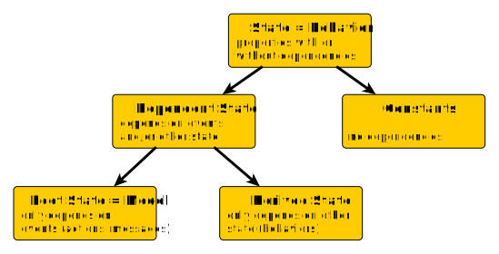

# Introduction to MVU, State Management, Reactive Programming and Effects Management

This introduction aims at a common understanding for the need of state- and effects-management, as well as reactive programming and why all of those are strongly tied together.

* _State Management_ is used to make dependencies explicit and isolate them from code using the state.
* _Effects Management_ is used to make side-effects explicit and isolate them.
* _Reactive Programming_ is used to make changes to the state explicit and abstract away time-dependencies. Both, _State Management_ and _Effects Management_ are a natural consequence of reactive programming.

While _rx-signals_ can be used in other contexts, it's main purpose is to implement architectures using the _**M**odel-**V**iew-**U**pdate_ pattern (MVU).

The MVU pattern emerged from [**TEA** (**T**he **E**lm **A**rchitecture)](https://guide.elm-lang.org/architecture/index.html), which was the inspiration for many MVU-libraries in other languages, the most famous one being [_Redux_](https://redux.js.org/).

> TEA itself, is the result of a journey that started with a [master thesis on concurrent FRP by Evan Czaplicki](https://elm-lang.org/assets/papers/concurrent-frp.pdf), the creator of _Elm_.
> An initial version of the _Elm_ programming language was part of that thesis and already aimed at simplifying FRP as much as possible.
> Subsequent simplifications and improvements got rid of all the FRP/RP terminology and (so far) ended in TEA _aka_ MVU, which however still represents a reactive programming approach (and a good one at that).
> If you're using _Redux_ (correctly), then you're also applying reactive programming (_Redux_ is a RP-library and this just naturally includes state management).

One of the big advantages that _Elm_ has over e.g. _Redux_ (or _rx-signals_) is that you cannot break reactivity (you cannot break MVU), something that can only be achieved, if the language itself enforces it.
In the JS/TS world, regardless of the framework being used, you can always work around the framework, use unmanaged side effects, mutate things you should not mutate, etc. and thereby break reactivity and other things (either intentionally or by accident).
This gives you more freedom at the price of never being sure not to break things with what you do.
You can mitigate this price by getting a good understanding of the principles behind MVU/RP/State/... and how they help to reduce the risk of "breaking things by accident" and at the same time increase the ability to reason about your code.
Giving a start on this understanding is the main purpose of this part of the documentation.

## Model-View-Update

In its basic form, the MVU pattern is often visualized as a cycle:


However, a key-property of MVU implementations is that all data flowing through this cycle is immutable (in following sections, we will see some reasons why this is of utmost importance).
Thus, the diagram should **not** suggest a mutation of the model, but instead a new, immutable model is created for each update.

That is, _Update_ can be described as a function: **_Update(Model<sub>n</sub> , Event) -> Model<sub>n+1</sub>_**

_View_ can be decribed as a function: **_View(Model<sub>n</sub>) -> UI<sub>n</sub>_**

In TEA, the _Events_ are called _Messages_, while _Redux_ and many others call them _Actions_.
In _rx-signals_, we call the _Events_, well, _Events_.

> The diagram shows the UI as event source, but later on we will see that other event sources are possible too.

Comparing MVU with MVC (Model-View-Controller), a major difference is that MVU has an unidirectional data flow, while MVC has a bidirectional flow (the controller updates the view on model changes and updates the model on events).
Apart from higher decoupling, the unidirectional flow makes reasoning and debugging much more simple (if Model and UI are out of sync in bidirectional flow, it can be hard to find out which one is right).

With unidirectional flow, the order of changes in Model and UI always matches: _UI<sub>n</sub> = View(Model<sub>n</sub>)_

Thus, in MVU, the _n-th_ UI is always a result of the _n-th_ Model.

With bidirectional flow you have: _UI<sub>n</sub> = Controller(Model<sub>m</sub>)_ **AND** _Model<sub>n</sub> = Controller(Event)_

Thus, in MVC, there is no clear order of changes.

## State Modelling

We have to start with some definitions to make sure we're talking about the same things when using certain terminology.

Considering the locality of state, we can differentiate between global state that is accessible by all components and local state that is only accessible by the component that owns the state (where 'component' could be any kind of modular building block):


Considering the dependencies of state, we can differentiate into the following hierarchy:



Strictly speaking, constants are of course no state, but in the context of _rx-signals_, it helps to think **State == Behavior** and as it is totally valid to put constants into an _rx-signals_ behavior, we consider constants just as a special case of state here.
It's not only valid, but also useful to model constants as behavior, in cases where constants are not immediately available (see [reactive DI](https://github.com/gneu77/rx-signals/docs/rx-signals_start.md#reactive-di)).

So the **Root State** corresponds to the **Model** in MVU.
This means, in MVU, all logic for **Derived State** must be part of the _View_ function.
_Redux_ and _NgRx_, use so-called _Selectors_ for **Derived State**, however the _View_ function is composed of more than just these _Selectors_. 
E.g. in _React + Redux_, a _render_ function with _useSelector_ hook would be a _View_ function.
A common mistake of MVU-beginners is to model **Derived State** as part of the **Root State**, an issue that will be part of the next sub-sections topics.

The following sub-sections will cover:
* The problem of invalid state (and why we need to model dependencies in our state explicitly and declaratively)
* Why we need global state management

### The problem of invalid state

To illustrate the challenge of valid state modelling, we can use simple local state examples (and then transfer our learnings to global state later).
In the following example, we are just using an (admittedly useless) class as example component:
```typescript
class Example {
  a: number;
  b: number;
  a_plus_b: number;

  constructor(a: number, b: number) {
    this.a = a;
    this.b = b;
    this.a_plus_b = this.a + this.b;
  }
}
```
If the three fields were readonly, this would be fine, but as it is, `a` and `b` can change and thus, there is no guarantee that `a_plus_b` is always what it's name says.
We could instead call it `readonly a_plus_b_at_construction_time`, but what if we really want it to always be `a` plus `b`?
The given example has no mechanism to make sure of this, so it's very easy to end up with an invalid state.
You could say the implementation is lying when calling it `a_plus_b`.

The underlying problem is that we defined the dependencies of `a_plus_b` only implicitly (implied by name, saying '_Hey co-developer, please keep in mind `a_plus_b` should be the sum, whenever you update `a` or `b`_'), rather than doing it explicitly.
Here is _Variant 1_ to do it explicitly (spoiler: it's a very bad):
```typescript
// Variant 1
class Example {
  private _a: number;
  private _b: number;
  private _a_plus_b: number;

  set a(v: number) {
    this._a = v;
    this._a_plus_b = this._a + this._b;
  }
  get a() { return this._a; }
  set b(v: number) {
    this._b = v;
    this._a_plus_b = this._a + this._b;
  }
  get b() { return this._b; }
  get a_plus_b() { return this._a_plus_b }

  constructor(a: number, b: number) {
    this.a = a;
    this.b = b;
  }
}
```
Ok, we've chosen an imperative way to model the dependency by always assigning the right value in setters.
Thereby, we made sure to account for all changes in `_a` and `_b` coming from outside the class.
But other developers might still add methods to our class where they modify `_a` or `_b` directly without thinking about updating `_a_plus_b`.
So we could still end up with an **invalid state**, hence we **failed** in making the dependency really explicit.

The mistake is that we modelled `_a_plus_b` as **Root State**, while it clearly should be **Derived State**.
Of course, in this trivial case, no developer would ever come to the idea to implement the horrible mess we saw in _Variant 1_, but instead one would model the dependent value as transient property like in _Variant 2_:
```typescript
// Variant 2
class Example {
  a: number;
  b: number;
  get a_plus_b() { return this.a + this.b }

  constructor(a: number, b: number) {
    this.a = a;
    this.b = b;
  }
}
```
Now we modelled the dependency explicitly in a declarative way.
It is no longer possible to end up with an invalid state (with respect to our rule that `a_plus_b` must always be the sum of `a` and `b`).
> Modelling dependencies explicitly in a way that invalid state is impossible (that the dependencies cannot be broken) is only possible by doing it declaratively!

Let's do a short comparison:
_Variant 1_ | _Variant 2_
------------|------------
implicit dependency | explicit dependency
invalid state must be covered by tests | invalid state impossible
imperative | declarative
eager | lazy
low readability | high readability

Invalid state is a bad thing, because it is equivalent to a bug.
It may not result in a bug in the current state of your application, but it lurks there and may surface in the future.
To catch such '_lurking bugs with future changes_', your tests must cover it.
The latter, as we will see next, quickly scales from 'annoying' to 'impossible'.

So far, we looked at a case with 3 properties, where one property was dependent on two other:


Now assume a case where your state consists of 12 boolean properties `A` to `L`:


This might seem ridiculous for a local state, but a full UI-application-state is likely much more complex (and also a single component could be something bigger and more complex than a class).
If none of those dependencies would be coded explicitly (so if none of these arrows is declared/encoded in the implementation), we would have `2^12 = 4096` different states.
In reality however, there are only `2^4 = 16` valid states!
To detect those '_lurking bugs with future changes_' (those 4080 invalid states) your tests would have to cover all 4096 cases!

In contrast, if all shown dependencies are coded explicitly, decalaratively (unbreakable / making invalid state impossible), you only have to write tests for each dependency individually, that is `2^2` cases for `C`, `2^1` cases for `K`, etc. -- summing up to `28` test cases in total.
And we were just talking about booleans...

:warning: Dependencies should be coded declaratively in a way that makes invalid state impossible!

With this rule, we already covered one of the core-features of reactive programming.
If you violate it, you break reactivity!
Even more important, if you violate it, you are making the life of your co-developers (and future developers maintaining your code) exponentially harder.

> Sometimes programmers tend to write imperative instead of declarative code, because they are concerned about performance.
> While declarative code might be slower in some cases, it rarely is a bottleneck.
> If it is, you can still code the critical part imperatively and properly encapsulate it in a pure function (if you do, please give your fellow devs some more detailed information than the dev of [this famous example](https://en.wikipedia.org/wiki/Fast_inverse_square_root) did).
> Using imperative code instead of declarative code is _Premature Optimization_.
> The same holds true for using mutable instead of immutable data.

But the differentiation between **Root State** and **Derived State** and thus, the declarative modelling of dependencies is not always as trivial as in the previous example!
Let's go back to a 'simple' 3-property example:
```typescript
class Example {
  query: string;
  result: string[];
  loading: boolean;
  ...
}
```
It's not rare to see something like this in real code (though maybe not localized in a class, but e.g. the `loading` property being provided by a service that is used to perform the query).
Often you see the loading-state being set imperatively and people think they cannot end up with invalid state, if '_request, error-handling and setting the loaded-state_' is properly encapsulated.
This however is not true, because the dependency for the loading-property is not even part of the whole state as it is currently designed!
The dependency is '_loading must be true, if a query-request is in progress, else it must be false_'.
Whatever logic we implement to set `loading`, a state `loading === true` can only be valid, if the HTTP-call is in progress, but if you snapshot such valid state and then restart your application with that state, it's suddenly invalid!

:warning: The validity of application state must not depend on properties that are not part of the state!

But how can we define `loading` declaratively as **Derived State**?
One way would be like this:
```typescript
class Example {
  query: string;
  result: { 
    usedQuery: string | null;
    result: string[]; 
  };
  get loading() { return this.query !== this.result.usedQuery };
  ...
}
```
In this example, `loading === true` would also be the trigger to automatically perform a new query-request.
(In case the search should only be performed in response to a certain event, you would have to extend your state by a certain `trigger` property and you would have to further extend your `result` property by a `usedTrigger`.)

So in this case, to declare `loading` declaratively in a way that it's always valid, we had to change the definition of other parts of the state.
Other designs to achieve the same would be possible.
However, with respect to _rx-signals_ you should stick with the following:

:warning: Whenever state (root or derived) is used as input to an async result, the result must include the input!

### The need for global State Management

So far, we considered local state.
But of course, at least in UI development, it is very likely to have application state that has dependencies between properties of different components.
If a `Component A` has a property `a` that depends on a property `b` from `Component B`, then you would also have a dependency between the two components.
Dependencies between components promote monolithic, highly coupled code.
They likely introduce the need for mockup in your tests.
Let's look back at the complex-dependencies-example from the last section, just with a slight modification:


Here, I introduced a cyclic dependency between properties `G`, `L` and `I`.
And now assume these properties are distributed over different components.
There's nothing wrong with cyclic dependencies between properties in general, as long as there's a condition that prevents infinite loops.
But if `G`, `L` and `I` would be managed by 3 different components, we would end up with those components being tightly coupled and our build system might even frown upon the cyclic dependency.

So we have two opposing apsects:
1. We want to have explicit dependencies in our state
2. We want to have no dependencies between our components

**Global _State Management_ is a solution to this problem.**
It separates the state (and it's inherent dependencies) from the components.
That gives you:
* Decoupled components (and thus, better testability and maintainability)
* State with dependencies that can be tested separately from the components using the state

Many people have problems to decide which properties to put under global state management and which not.
Some people even advise that for simple applications, you might not need a state management at all.
In reality, the decision is not that hard:

:warning: Whenever a property needs to be shared between components (e.g. due to declarative dependencies), then you should put it under global state management!

I could be even more strict and just say: 'As soon as you have state, it should be managed!' (The use of global variables is an example of unmanaged state).

## Change propagation and Reactive Programming

Up to this point, we discussed things concerning the question '_What is the value of property X?_'.
Now we will address the question '_When does the value of property X change?_'.

Coming back to the example with a local declarative dependency:
```typescript
class Example {
  a: number;
  b: number;
  get a_plus_b() { return this.a + this.b }

  constructor(a: number, b: number) {
    this.a = a;
    this.b = b;
  }
}
```
We solved the problem '_What is `a_plus_b`_'.
Properties that depend on `a_plus_b` may be declared similarly.
All these declaration are lazy, hence they are evaluated at the point of time when they are accessed.
But how does a component depending on `a_plus_b` know it must re-evaluate the value (equivalent to how does the framework know when to update the view)?

> If you're an Angular developer and you think the answer is "_the framework simply checks everything whenever any property in the whole application changes_", then let me just say **NO**. It is a workaround (a bad one), but it's no solid solution and the fact that OnPush change detection is still not the default in Angular is just a big shame!

The problem how to do it right boils down to the question '_How to model values that can change over time?_'.
So far, for values that are constant over time, we used immutables like `readonly a: number` or `const a: number`, while we used mutables like `let a: number` or transitive properties for values that can change over time.

There is however a much better way to model values that can change over time, still allowing for lazy evaluation, but in addition also solving the notification problem:

`const a: Observable<number>`

An `Observable<T>` is a value-stream from the _RxJs_ library that corresponds to the [_Subject_ in the classic Observer-pattern](en.wikipedia.org/wiki/Observer_pattern).
It's a specific implementation of the more general [Publish-subscribe-pattern](https://en.wikipedia.org/wiki/Publish%E2%80%93subscribe_pattern), hence the `Observable` is a registry that _Observers_ (aka _Subscribers_, aka _whoever is interested in value changes_) can subscribe to (register a callback).
Mastering _RxJs_ is beyond this introduction, but essential for _rx-signals_.
You can learn it [from here](https://rxjs.dev/guide/overview), but some important key aspects will also follow within this document.
Even more aspects and details will be covered as part of the [Using _rx-signals_ guide](https://github.com/gneu77/rx-signals/docs/rx-signals_start.md)

We no longer need mutable variables to model state, but instead we wrap immutable values into `Observables`.
In contrast to transient properties that we used in one of the initial examples, we can now define all identifiers immutably and declaratively with included change propagation.
Immutability makes comparison and thus, detection of which parts of the state-tree have been changed trivial, hence more performant.
It also helps a lot in reasoning, debugging, time-travel-logic, etc.

Actually, keeping your state immutable is even mandatory in _rx-signals_, due to the fact that all [_behaviors_ are auto-piped with _distinctUntilChanged()_](https://github.com/gneu77/rx-signals/docs/rx-signals_start.md#distinct_pipe).

:warning: Properties defining state must always be immutable!

<a name="abstract_away_time"></a>
Answering '_What is the value of property X?_' by declarative definition takes care of explicit, unbreakable dependencies.
Representing _property X_ as an _Observable_ answers the question '_When does the value of property X change?_' explicitly, abstracting away the burden to think about the '_At which point of time?_'.

> Let me elaborate on the difference between '_When?_' and '_At which point of time?_'.
> Assume 3 Events `e1, e2, e3` that occur at points of time `t1, t2, t3`.
> The _When?_ does only care about receiving the corresponding event, but it does not care about the time this event was produced.
> More important, it does not care about the time between receiving events.
> The time between receiving `e1` and `e2` might be 10-times of `t2-t1` (the difference of the points of time where the events were generated).
> While the differences between receiving the `eN` can be completely different from the differences between the corresponding `tN`, the correct order of events is preserved.
> With that, all those classic issues of invalid state due to race-conditions, are just not possible.

The combination of explicit, declarative definitions and automatic change propagation is _Reactive Programming_.

It's time to hint at some first differences between _rx-signals_ and other popular state-management libraries.
In _rx-signals_ the individual properties (that is all state) are represented by individual behaviors, the latter being nothing else but _Observables_ (with current value).
[_Redux_](https://redux.js.org/) models the **Root State* (properties that depend only on events and previous value) as a single object and represents this state as the single only observable.
**Derived State** is modelled by _Selectors_ (functions mapping the root-state) that are used inside a subscribe-block (if you're used to _React_, you usually don't subscribe explicitly, but use the _Provider_ component that does this for you and calls _mapStateToProps_ or triggers a _useSelector_ hook, where then you use _Selectors_).
[_NgRx_](https://ngrx.io/) mixes the two approaches, by also using a single object for the root-state, but modelling selectors as individual observables.
An advantage of modelling also **Derived State** as _Observables_ is that it moves the subscription closer to the actual consumer of the properties, because calling _subscribe_ on an _Observable_ marks the border between declarative and imperative code and thus, in principle breaks reactivity.
However, with respect to _React-Redux_, as long as e.g. your _mapStateToProps_ is pure, that's no real concern.
The real advantage of _rx-signals_ in not using a single state object is that it enables further abstraction and composition via _Signals_ and _SignalFactories_.

Observables abstract away the difference between sync and async code.
They also abstract away things like race conditions.


## Side-effects

The previous sections discussed how to properly model state with explicit dependencies and how to propagate changes of the independent parts of the state down through all the dependent parts.
A remaining question is how changes are applied to the independent state parts in the first place?

It's done by sending a certain _event_ that initiates the change.
Sending (dispatching) such an _event_ is a side-effect.
In MVU, it's a managed side-effect, where "managed" means "explicit and isolated".

So next, I like to assert on why it is of utmost importance to have only managed side-effects and with that, why event sources should be the only side-effects you have in your whole application:

In programming, side-effects are the root of all evil.
Let's have a look at just some of the many advantages that pure functions (no side-effects and referential transparancy) have over impure functions:
1. simple to reason about (for programmers **and** compilers)
2. simple testing (no mockup-hell)
3. simple composition (tackling complexity)
4. simple to debug
5. simple memoization
6. simple parallelization (no locking, no race conditions)
7. simple lazy evaluation
8. ...

I will elaborate on the big advantages in testing in the corresponding _rx-signals_-testing part.
An example for composition will be handled in the introduction to _rx-signals_ `SignalFactories`.
The _simple to reason about for programmers_ point is a wide topic, but mostly boiling down to enabling programmers to grasp everything a function does from its signature and name only.
If you're not able to reason about a function by signature and name only due to impureness, then you have to read and understand its implementation.
This breaks encapsulation and abstraction, cause it makes no sense to hide implementation details in the first place and then enforce users to understand those details!
This does not mean that one should not use encapsulation for impure code.
The opposite is the case, but it must be done in an explicit way that makes clear where and when side-effects happen!

What makes impure functions really annoying, is that they are infectuous.
Once you have a single impure function in your call-tree, everything above is impure too.
So everything you combine with it or with something above gets impure too.
And everything that gets impure has to be mocked in testing.
Also for each and every change in the "infected" part of a call tree, you have to go down the tree and analyze the code to reason about the impact of your changes (If you don't spend this effort, you might end-up with things like the [log4j-disaster](https://nvd.nist.gov/vuln/detail/CVE-2021-44228) ).
You have to do this for all branches until you reach pure functions (or the end).

Therefore, impure functions must be pulled up in the call-tree as far as possible (aka _functional core, imperative shell_ pattern).
This is what "isolated" means in the context of this section.
In a pure functional language (like e.g. Elm or Haskell), the side-effects are pulled up into the runtime.
In a multi-paradigm language like JS/TS, we cannot go that far, but we can still separate/isolate side-effects from the rest of our code in a clean way.

In the [**Using _rx-signals_**](https://github.com/gneu77/rx-signals/docs/rx-signals_start.md) documentation, you will see how side-effect isolation by event-sources works (especially in the testing section).


## Big Picture

In the end the things discussed in the previous sections are all just different apspects of the same thing.

* _Declarative_ implies _Immutability_ and vice versa
* _Declarative_ implies _Explicit Dependencies_ and vice versa
* Non-local _Dependencies_ imply _State Management_
* _State Management_ and _Explicit Dependencies_ imply _Effects Management_
* _Declarative_ and _Dependencies_ imply _Change Propagation_
* _Change Propagation_ implies _Immutability_
* etc.

=> _Reactive Programming_ (done right) implies all of it


