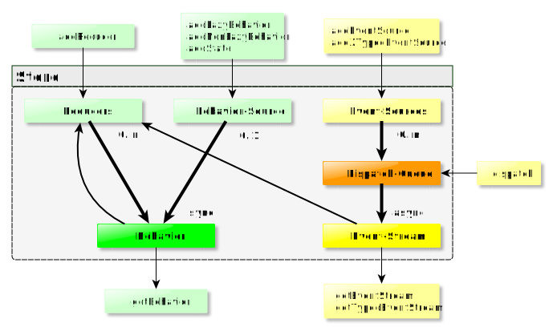
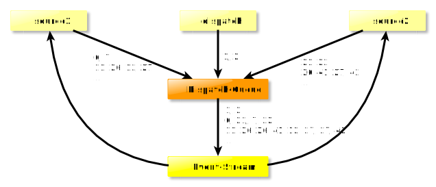
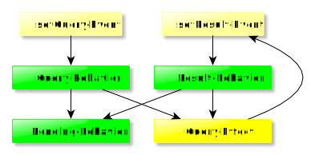
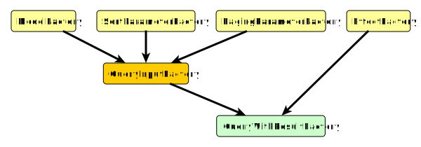

# Using rx-signals

1. [Design goals](#design)
1. [Using the store](#store)
    1. [Signal Identifiers](#type-identifiers)
    1. [Events](#events)
    1. [Behaviors](#behaviors)
    1. [Reactive-DI](#reactive-di)
1. [Encapsulation via Signals-type](#signals-type)
1. [Reusability via SignalsBuild](#signals-build-type)
1. [Composition via SignalsFactory](#signals-factory-type)
1. [Side-effect isolation via Effect](#effect-isolation)
    1. [The EffectSignalsFactory](#effect-signals-factory)
1. [Testing](#testing)

## Design goals <a name="design"></a>

Coming from my [introduction to MVU, State Management, Reactive Programming and Effects Management](https://github.com/gneu77/rx-signals/blob/master/docs/rp_state_effects_start.md), the major design goals should be pretty clear:
* Keep all data immutable
* Make dependencies explicit/declarative
* Use a reactive architecture
* Isolate side-effects explicitly

There is more however:
* Guarantee type-safety everywhere
  * catch issues at compile time
  * deliver state-of-the-art IDE experience
* Embrace _RxJs_
  * if you master _RxJs_ you've already mastered 80% of _rx-signals_
* Offer clean abstractions for encapsulation
* Offer clean abstractions for re-usability

## Using the store <a name="store"></a>

The _rx-signals_ store is a class to reactively manage state and effects.
(It can also be used for local state and effects management via child stores.)

* With respect to [state management](https://github.com/gneu77/rx-signals/blob/master/docs/rp_state_effects_start.md), the store is used
  * to define dependencies explicitly
  * to hold root-state and sources for derived-state
* With respect to [reactivity](https://github.com/gneu77/rx-signals/blob/master/docs/rp_state_effects_start.md), the store is used
  * propagates changes via behaviors and event-streams
  * for reactive dependency injection
* With respect to [effects management](https://github.com/gneu77/blob/master/rx-signals/docs/rp_state_effects_start.md), the store
  * is the _world_ as pure function argument
  * is used to inject isolated side-effects

The following diagram gives an overview for the _Store_ architecture and API.
For the full API, please see the [corresponding documentation](https://rawcdn.githack.com/gneu77/rx-signals/master/docs/tsdoc/index.html)

<a name="architecture"></a> 

### Signal Identifiers <a name="type-identifiers"></a>

Signal identifiers
* are used to uniquely identify a behavior or event-stream of the store
* provide type-safe access to behaviors and event-streams

A signal identifier can be either an event- or behavior id: `type SignalId<T> = BehaviorId<T> | EventId<T>`

For a given event- or behavior-type `T`, you can obtain a new, unique id using `getEventId<T>():` or `getBehaviorId<T>():` (these are not store methods, but independent utility functions).

Under the hood, the returned identifier is a `symbol`. Thus, e.g. two calls of `getBehaviorId<number>()` will return two different identifiers!

### Events <a name="events"></a>

If you don't know what an event-stream in the sense of RP is, then head back to [Terminology](https://github.com/gneu77/rx-signals/blob/master/README.md#terminology).

So in _rx-signals_, an event-stream is an _RxJs_-observable that has no current value, but dispatches values to subscribers at dicrete points of time. In addition to this definition, _rx-signals_-event-streams
1. always behave as hot observables piped with `share()`.
1. can have multiple sources that are subscribed by the store lazily (so only if the corresponding event-stream is subscribed)

> _Events_ are similar to actions in _Redux_-like libs.
> However, in contrast to _actions_, they are no objects with type and value, but instead they are the dispatched values itself.
> The type (event-type, NOT event-values-type) is an extra-argument to dispatch. Subscribers, specifically subscribe to one type of event.
> Here, type and event-ID is the same thing.

#### Event-streams and basic event-sources

For a given `EventId<T>`, you can get the corresponding event-stream from the store as follows:
```typescript
store.getEventStream(id: EventId<T>);
```
The return value of this method is an `Observable<T>` and TypeScript will infer the correct generic type for the returned observable, because it is encoded in the `EventId`.

From now on:
* the term _event-values-type_, always means the generic type of values
* the term _event-type_, means a certain `EventId<T>`
Thus, for `const luckyNumbers = getEventId<number>();`, the _event-type_ would be `luckyNumbers`, while the _event-values-type_ would be `number`,

There can be multiple sources for a given _event-type_. One source that all event-streams have is a call to the dispatch function:
```typescript
store.dispatch(id: EventId<T>, value: T);
```

Calling `dispatch` for an _event-type_ that has no subscribed event-stream is a No-Op.

You can add further event-sources as follows:
```typescript
store.addEventSource(
  sourceIdentifier: symbol,
  eventId: EventId<T>,
  observable: Observable<T>,
);
```
* a `sourceIdentifier` is required, because it must be possible to remove event-sources from the store.
* `eventId` is your _event-type_
* `observable` can be any observable of the correct _event-values-type_ (even a behavior)
  * The store will **not** eagerly subscribe the source-observable, but only, if the corresponding event-stream is subscribed

Of course, even if all added event-sources for a given _event-type_ complete, the corresponding event-stream will **not** complete (other sources may be added in the future / manual `dispatch` is always possible).

> Apart from using events to change behaviors (a core principle of reactive programming), you can of course also simply use the store as type-safe event-bus. 

#### Dispatch process

There are some important **guarantees** concerning event-dispatch (whether manually or via event-sources):
* The store always dispatches events asynchronously
  * Relying on synchronous dispatch would break reactive design (remember that one purpose of RP is to [abstract away the need to think about time](https://github.com/gneu77/rx-signals/blob/master/docs/rp_state_effects_start.md#abstract_away_time)). The async dispatch also enables definition of cyclic dependencies.
* Though async, the order in which events are dispatched will always be preserved
  * So dispatching e.g. two events `A`, `B`, the `B` will be dispatched only after **all** subscribers got the `A`
  * This holds true even for the dispatch-order between parent- and child-stores (cause they're using a shared dispatch-queue)
  * (This is one aspect that is not trivial to get right when wireing-up complex dependencies using plain _RxJs_ on your own)

Let's see this in action:
```typescript
const myEvent = getEventId<number>();
store.getEventStream(myEvent)
  .pipe(take(7))
  .subscribe(console.log);

store.addEventSource(
  Symbol('source1'), 
  myEvent,
  store.getEventStream(myEvent).pipe(
    filter(v => v === 3),
    mapTo(7)
  )
);
store.addEventSource(
  Symbol('source2'),
  myEvent,
  of(3, 4, 5)
);
console.log(1);
store.dispatch(myEvent, 6);
console.log(2);
```

The output will be in order of the numbers:
1. `source2` adds `3`, `4` and `5` to the dispatch queue
1. `1` is logged
1. `6` is added to the dispatch queue
1. `2` is logged
1. Store dispatches `3` 
    1. `3` is logged
    1. `source1` adds `7` to the dispatch queue
1. Store dispatches `4`
...(etc)

Please have in mind that dispatching an event is always a side-effect. That means
* you should use `dispatch` only to translate non-store events (like browser events) to store events
* event-sources are either effects or event-transformers (mapping from one _event-type_ to another)
  * though on a low-level, all side-effects could be implemented via event-sources, the store has an additional way to describe input-output-effects via the `Effect` type. This will be described later in the [EffectSignalsFactory section](#effect-signals-factory).

The previous example was already a bit complicated and you should strive for a low number of event-sources that would lead to automatic dispatch->state->dispatch cycles.
Nevertheless, it's important to fully understand how the dispatch-queue works.
Say _N_ events are added to the dispatch-queue before the dispatch-queue-handler is invoked (asynchronously by the JS-event-loop), the handler will dispatch those _N_ events synchronously (in the order they were added).
Dispatching the _N_ events might lead to _M_ new events being added to the dispatch-queue.
Those _M_ new events however, will not be dispatched immediately, but again asynchronously in one of the next cycles of the JS-event-loop.
The following example illustrates this:
```typescript
const myEvent = getEventId<number>();
store.getEventStream(myEvent)
  .pipe(take(14))
  .subscribe(console.log); // 1, 2 -> 6, 21, 7, 22 -> 11, 26, 26, 41, 12, 27, 27, 42

store.addEventSource(
  Symbol('source1'),
  myEvent,
  store.getEventStream(myEvent).pipe(
    map(e => e + 5), // 6, 7 -> 11, 26, 12, 27
  ),
);
store.addEventSource(
  Symbol('source2'),
  myEvent,
  store.getEventStream(myEvent).pipe(
    map(e => e + 20), // 21, 22 -> 26, 41, 27, 42
  ),
);
store.dispatch(myEvent, 1);
store.dispatch(myEvent, 2);
```



(So 1 and 2 are dispatched synchronously, then in one of the next JS-event-loop-cycles 6, 21, 7 and 22 are dispatched synchronously, etc.)

#### Typed event-sources

You can also add event sources that dispatch multiple _event-types_.
E.g. a source that can dispatch 2 different _event-types_ with corresponding _event-values-types_ `A` and `B`:
```typescript
store.add2TypedEventSource(
  sourceIdentifier: symbol,
  eventIdA: EventId<A>,
  eventIdB: EventId<B>,
  observable: Observable<TypedEvent<A> | TypedEvent<B>>,
  subscribeObservableOnlyIfEventIsSubscribed?: null | EventId<any>
)
```

As you can see, in this case, the source-observable must provide values of
```typescript
type TypedEvent<T> = Readonly<{
  type: EventId<T>;
  event: T;
}>;
```
so that the store knows which _event-type_ to dispatch.

You might wonder about this optional parameter with the horrible name `subscribeObservableOnlyIfEventIsSubscribed`. Well, I was just not able to come up with a better name.
It is however one of the most powerful features of the store!
Think about the following scenario:
* You have an effect that
  * produces the _event-types_ `myEffectSuccess` and `appError`
  * should **only** be executed, if the `myEffectSuccess` event is actually subscribed.
* You have a generic error-handler that subscribes to an _event-type_ `appError` over the whole lifetime of your application.

```typescript
store.add2TypedEventSource(
  Symbol(),
  myEffectSuccess,
  appError,
  of(
    { type: myEffectSuccess, event: mockResult },
    { type: appError, event: mockError },
  ),
  myEffectSuccess // subscribeObservableOnlyIfEventIsSubscribed
)
```

Without the last parameter, the `store.getEventStream(appError)` that you have somewhere in your global error-handler would automatically subscribe your 2-typed-event-source. Thus, the requirement that the effect should only be executed, if `myEffectSuccess` is subscribed would not be fulfilled.
However, with the last parameter, we are telling the store to subscribe the source only if `myEffectSuccess` is subscribed.

### Behaviors <a name="behaviors"></a>

If you don't know what a behavior in the sense of RP is, then head back to [Terminology](https://github.com/gneu77/rx-signals/blob/master/README.md#terminology).

In _rx-signals_, a behavior is an _RxJs_-observable that always has the current value when subscribed.
Behaviors represent observed state, either being root-state or derived state.
In addition to this definition, _rx-signals_-behaviors
1. can be non-lazy or lazy
    1. Non-lazy behaviors are subscribed by the store itself as soon as you add a corresponding behavior-source to the store.
    1. Lazy behaviors will **not** be subscribed by the store itself, as long as there are no subscribers.
1. <a name="distinct_pipe"></a> always behave as if piped with `distinctUntilChanged()` and `shareReplay(1)`. (However, internally they do **not** use `shareReplay(1)` and thus, there is **no** risk of the memory-leaks that are possible with `shareReplay`.)

Behaviors are used to model application state. Make sure to understand the importance of [modeling dependencies in your state explicitly](https://github.com/gneu77/rx-signals/blob/master/docs/rp_state_effects_start.md).
As a rule of thumb, root-state (state that depends on events only) should be non-lazy, while derived-state should be modeled using lazy behaviors. (It is however also possible to make the complete state lazy, as well as it's possible to have non-lazy dependent state.)

#### Basic behaviors

No big surprise that getting a behavior from the store just requires a `BehaviorId<T>`:
```typescript
store.getBehavior(behaviorId);
```

Adding a lazy behavior source can either be done by:
```typescript
store.addDerivedState(
  identifier: BehaviorId<T>,
  observable: Observable<T>,
  initialValueOrValueGetter: T | (() => T) | symbol = NO_VALUE,
);
```

or by using the low-level method `addBehavior` with the corresponding `subscribeLazy` argument set true:
```typescript
addBehavior<T>(
  identifier: BehaviorId<T>,
  observable: Observable<T>,
  subscribeLazy: boolean,
  initialValueOrValueGetter: T | (() => T) | symbol = NO_VALUE,
);
```

Consequently, setting `subscribeLazy` to false, the same method can be used to add a non-lazy behavior source.
In most cases however, you should use the `addState` method described in the next sub-section!

* The `observable` argument to `addBehavior`, is the source of the behavior
  * In contrast to event-streams, a behavior can have only one source. So if you call `addBehavior` (or `addState` or `addDerivedState`) two times with the same identifier, you will get an error on the second one (though you can remove a behavior source via `removeBehaviorSources` and then add a new source with the same identifier).
  * As for event-streams, if the behavior-source completes, the behavior will **not** complete.
    * In addition, after a behavior-source has completed, new subscribers of the behavior will still get the last value, as long as the behavior-source is not explicitly removed from the store!
    * (However, having completing behavior-sources is often bad design. Prefer child-stores for behaviors that do not share the complete application lifetime.) 
* The `initialValueOrValueGetter` is optional. It can be an inital value or a function that yields the initial value (so if the behavior is never subscribed, then the function will never be called).

When you call `getBehavior` you're not just getting a piped observable of whatever you added as behavior-source.
For example, you can subscribe a behavior even before a corresponding source has been added.
This is what makes cyclic dependencies and reactive dependency injection possible.

Here's an all-lazy example:
```typescript
type QueryResult = {
  result: string[];
  resultQuery: string | null;
};

const query = getBehaviorId<string>();
const result = getBehaviorId<QueryResult>();
const pending = getBehaviorId<boolean>();
const setQuery = getEventId<string>();
const setResult = getEventId<QueryResult>();

store.addBehavior(query, store.getEventStream(setQuery), true, ''); // or addDerivedState
store.addBehavior(result, store.getEventStream(setResult), true, {
  result: [],
  resultQuery: null,
});
store.addBehavior(
  pending,
  combineLatest([store.getBehavior(query), store.getBehavior(result)]).pipe(
    map(([q, r]) => q !== r.resultQuery),
  ),
  true,
);
store.addEventSource(
  Symbol('MockupQueryEffect'),
  setResult,
  combineLatest([store.getBehavior(query), store.getBehavior(result)]).pipe(
    filter(([q, r]) => q !== r.resultQuery),
    debounceTime(100),
    switchMap(([q]) => of({ result: [`mock result for ${q}`], resultQuery: q })),
  ),
);
```

Phew, a lot of code for a trivial (simplified) example!
But don't fear, there's no need to repeat such common patterns thanks to `Signals` and `SignalsFactories`.
Also, there's a better and more general way to cope with effects, all of this being demonstrated in the [EffectSignalsFactory section](#effect-signals-factory).

Here's a visual representation of the above setup:



As all behaviors are lazy, dispatching a `setQuery` event will be a no-op, as long as none of the behaviors is subscribed.
Subscribing to the `query` behavior only, would still not trigger the effect.
But as soon as the `pending` and/or the `result` behavior is subscribed, the effect (event-source) will start operating.
In other words, it would be no problem to define the `query` behavior as non-lazy behavior (though there's no good reason to do so in this example).
In general, you should aim for as many lazy behaviors as possible.

However, there are definitely behaviors that must be non-lazy.
The rule is simple: If it would be a logical error that a behavior-source misses one of the events it depends on, then it must be non-lazy.
(See the docstring for store.addBehavior to get some more guidance on when to use lazy vs. non-lazy!)

So far, defining a behavior that depends on multiple different events would be a bit clumsy (you'd have to use `getTypedEventStream` instead of `getEventStream` to differentiate between the merged events).
Instead, you should use the state-reducer API from the next section to setup root-state-behaviors.

#### State-Reducer API

In addition to the general `addBehavior` method from the previous section, there are more idiomatic methods to add and reduce certain root-state.
```typescript
store.addState(identifier, initialValueOrValueGetter);
```
adds a non-lazy behavior-source (which so far would be equivalent to `store.addBehavior(identifier, NEVER, false, initialValueOrValueGetter)` or `store.addBehavior(identifier, of(initialValue), false)`).

However, you can add as many reducers for this state as you like, one for each event that should be handled (trying to add a second reducer with the same stateId **and** eventId would result in an error):
```typescript
store.addReducer(
  stateId: BehaviorId<T>,
  eventId: EventId<E>,
  stateReducer: (state: T, event: E) => T
);
```

It's time for the counter-example that is found in the documentation of almost all state-management libs (though for better demonstration, we use increaseBy and decreaseBy instead of simple increase/decrease):
```typescript
const counter = getBehaviorId<number>();
const increaseBy = getEventId<number>();
const decreaseBy = getEventId<number>();

store.addReducer(counter, increaseBy, (state, event) => state + event);
store.addReducer(counter, decreaseBy, (state, event) => state - event);
store.addState(counter, 0);
```

As you can see, it's no problem to add reducers **before** the state itself is added.
This is possible, because all the wireing is done based on identifiers and not on the corresponding observables.
Hence, decoupling is achieved by defining dependencies based on identifiers instead of concrete sources.
This is the same approach as in classic dependency injection, just better, because it's reactive...

### Reactive dependency injection <a name="reactive-di"></a>

Classic DI is used to decouple usage and creation of dependencies.
It thus allows for different concrete types without breaking dependencies, e.g. to allow for simple testability.
But there's a problem with classic DI. All dependencies still need to be available at the time of object creation (class instantiation), because they are used in imperative instead of reactive code.
Some DI-implementations even have problems with cyclic dependencies (which is no issue at all for our reactive DI).
Again, remember that one feature of RP is to [abstract away the need to think about time](https://github.com/gneu77/rx-signals/blob/master/docs/rp_state_effects_start.md#abstract_away_time).

Well, using _rx-signals_ your dependencies are just behaviors, it's as simple as that.
If you separate the setup of all other behaviors and event-streams, from the setup of behaviors for non-rx-signals-dependencies (like e.g. HTTP-services in an Angular application), you can run a single integration test over all those other signals without the need to mock anything at all!
This will be detailed in the [Testing section](#testing)

> You might say 'Wait, isn't this more like a reactive service locator?'.
> Well yes, the store is some kind of service locator.
> And also no, because you don't get the dependencies itself from the store, but you get them wrapped into an observable.
> This makes a difference, because some arguments against classic service locators do not apply to the _rx-signals-store_.
> Thus, I don't like to bring in this somehow biased term and instead keep calling it reactive DI.
> In classic-DI, you e.g. define an injection-point via annotated-interface and the DI-lib takes care to create and inject the concrete dependency at that point.
> In reactive-DI, your injection-point is a behavior you request from the store via an identifier that corresponds to the interface. The store then injects the concrete dependency as soon as it becomes available.
> The only drawback compared to classic-DI is that the depending code needs to know the store. However, being some kind of reactive-runtime, the store is practically needed everywhere.

## Encapsulation via Signals-type <a name="signals-type"></a>

In the previous section, we tallied that in _rx-signals_, decoupling is done by wireing dependencies based on identifiers.
But of course, we still want to be able to somehow bundle certain behaviors and events that belong together, to achieve encapsulation and high cohesion.
This leads to the following requirements:
* The creation of `SignalId`s and the setup of the store (using the `SignalId`s) must be separated somehow.
  * Because all `SignalId`s used in wireing must be available, when the setup starts.
* It must be possible to 'bundle' the setup of certain behaviors and event-sources with the corresponding `SignalId`s

Therefore, _rx-signals_ defines the `Signals` type as follows:
```typescript
type Signals<IN extends NameToSignalId, OUT extends NameToSignalId> = SetupWithStore & SignalIds<IN, OUT>;

// with:
type NameToSignalId = { [key: string]: SignalId<any> | NameToSignalId };
type SignalIds<IN extends NameToSignalId, OUT extends NameToSignalId> = {
  readonly input: IN;
  readonly output: OUT;
};
type SetupWithStore = { readonly setup: (store: Store) => void; };
```

The setup function must only add behavior- and/or event-sources to the store for output-signal-ids and signal-ids that are created by the setup function itself.
In contrast, it must not add any sources to the store using one of the input-ids!

:warning: Similar to `const x: Observable<T>` being the reactive and immutable counterpart of `let x: T`, you could see the `Signals` type as reactive and immutable counterpart of a class-instance.
Following this analogy, the in/out-`NameToSignalId` is the reactive counterpart of a class-interface.

Let's see an example, where we encapsulate the creation of signals for counters:
```typescript
type CounterInput = {
  increaseBy: EventId<number>;
  decreaseBy: EventId<number>;
};
type CounterOutput = {
  counterState: BehaviorId<number>;
};
const getCounterSignals: () => Signals<CounterInput, CounterOutput> = () => {
  const counter = getBehaviorId<number>();
  const increaseBy = getEventId<number>();
  const decreaseBy = getEventId<number>();
  return {
    input: {
      increaseBy,
      decreaseBy,
    },
    output: {
      counter,
    },
    setup: store => {
      store.addReducer(counter, increaseBy, (state, event) => state + event);
      store.addReducer(counter, decreaseBy, (state, event) => state - event);
      store.addState(counter, 0);
    },
  };
};
```

We can use `getCounterSignals` to create as many counters as we like.

Next, we encapsulate the creation of a signal that depends on two number-streams (calculating the sum of those numbers):
```typescript
type SumInput = {
  inputA: BehaviorId<number>;
  inputB: BehaviorId<number>;
};
type SumOutput = {
  counterSum: BehaviorId<number>;
};
const getSumSignals: () => Signals<SumInput, SumOutput> = () => {
  const inputA = getBehaviorId<number>();
  const inputB = getBehaviorId<number>();
  const counterSum = getBehaviorId<number>();
  return {
    input: { inputA, inputB },
    output: { counterSum },
    setup: store => {
      store.addDerivedState(
        counterSum,
        combineLatest([store.getBehavior(inputA), store.getBehavior(inputB)]).pipe(
          map(([a, b]) => a + b),
        ),
      );
    },
  };
};
```

The two factory functions `getCounterSignals` and `getSumSignals` are two functions that are free of any dependencies between each other (so not even on identifier-level).

Of course, we can create a function that composes the previous two functions to create counters with sum signals:
```typescript
// we will do better than this in the next section
type ComposedInput = {
  inputA: CounterInput;
  inputB: CounterInput;
};
const getCounterWithSumSignals: () => Signals<ComposedInput, SumOutput> = () => {
  const counterASignals = getCounterSignals();
  const counterBSignals = getCounterSignals();
  const counterSumSignals = getSumSignals();
  return {
    input: {
      inputA: counterASignals.input,
      inputB: counterBSignals.input,
    },
    output: {
      counterSum: counterSumSignals.output.counterSum,
    },
    setup: store => {
      counterASignals.setup(store);
      counterBSignals.setup(store);
      counterSumSignals.setup(store);
      store.connect(counterASignals.output.counter, counterSumSignals.input.inputA);
      store.connect(counterBSignals.output.counter, counterSumSignals.input.inputB);
    },
  };
};
```

(Again, please note that the order in which the setup functions are called is irrelevant.)

Also we learned about a new store method `connect` which is a shorter convenience method to connect an event or behavior to another event or behavior based on IDs (under the hood a corresponding event-source or behavior for the target id will be added to the store), hence to connect some output-signal to some input-signal.
Connect can be used to easily transform event-streams to behaviors and vice-versa.

The above way to compose a signals factory from two other factories might be OK in this trivial example.
But as soon as things get more complex, this kind of 'manual' composition becomes inflexible, verbose and error-prone.
E.g. it's easy to forget calling the setup function of one of the signals being composed.
And even if you don't forget it, it's still boilerplate.
The next sections present a signals factory type that allows for a much better, generalized composition.

## Reusability via SignalsBuild <a name="signals-build-type"></a>

The previous section introduced the `Signals` type as means of encapsulation/isolation of signal-ids and setup of corresponding signals in the `Store`.
The given example even used factory functions to produce `Signals` and a new factory function was composed from the two initial factory functions.
For more complex Signals, it might be neccessary to configure this kind of factory.
Therefore, _rx-signals_ formalizes such configurable factory as `SignalsBuild` type:
```typescript
type SignalsBuild<
  IN extends NameToSignalId,
  OUT extends NameToSignalId,
  CONFIG extends Configuration,
> = (config: CONFIG) => Signals<IN, OUT>;

// with:
type Configuration = Record<string, any>;
```

:warning: Back to our analogy of the `Signals` type being the reactive, immutable counterpart of a class-instance, a `SignalsBuild` is the reactive, immutable counterpart of a class/class-constructor.

## Composition via SignalsFactory <a name="signals-factory-type"></a>

As mentioned at the end of the `Signals` section, the manual composition of factory-function (hence `SignalsBuild` functions) is error-prone and needs a lot of boilerplate code.
To generalize factory composition, _rx-signals_ features the `SignalsFactory` class as a wrapper for `SignalsBuild`.
The following snippet just shows a part of the SignalsFactory methods.
We will encounter more methods later and you can consult [the corresponding API-documentation](https://rawcdn.githack.com/gneu77/rx-signals/master/docs/tsdoc/classes/SignalsFactory.html) for details of all methods.
```typescript
// This snippet only shows a small part of the full API!:
class SignalsFactory<IN extends NameToSignalId, OUT extends NameToSignalId, CONFIG extends Configuration> {
  constructor(readonly build: SignalsBuild<IN, OUT, CONFIG>) {}
  
  compose<IN2 extends NameToSignalId, OUT2 extends NameToSignalId, CONFIG2 extends Configuration>(
    factory2: SignalsFactory<IN2, OUT2, CONFIG2>,
  ): ComposedFactory<IN, OUT, CONFIG, IN2, OUT2, CONFIG2>

  extendSetup(extend: ExtendSetup<IN, OUT, CONFIG>): SignalsFactory<IN, OUT, CONFIG>;

  mapConfig<CONFIG2 extends Configuration>(mapper: MapConfig<CONFIG, CONFIG2>): SignalsFactory<IN, OUT, CONFIG2>;

  mapInput<IN2 extends NameToSignalId>(mapper: MapSignalIds<IN, IN2>): SignalsFactory<IN2, OUT, CONFIG>;
  
  mapOutput<OUT2 extends NameToSignalId>(mapper: MapSignalIds<OUT, OUT2>): SignalsFactory<IN, OUT2, CONFIG>;
}
```

Like `Signals`, also `SignalsFactory` instances are immutable, hence all methods return a new `SignalsFactory` instance (otherwise, it would not enable composition in a re-usable way)!

Before coming to a more real-world example, let's generalize the counter-sum-example from the previous section by turning the 'custom' signals factories into a `SignalsFactory`.
Based on our definitions for `getCounterSignals` and `getSumSignals`, we can turn these into `SignalsFactories` as follows:
```typescript
const counterFactory = new SignalsFactory(getCounterSignals);
const sumFactory = new SignalsFactory(getSumSignals);
```

Now, composition of these factories is simple:
```typescript
const getCounterWithSumSignalsFactory: SignalsFactory<ComposedInput, SumOutput> = 
  counterFactory
    .compose(counterFactory)
    .compose(sumFactory)
    .extendSetup((store, input, output) => {
      store.connect(output.conflicts1.counter, input.inputA);
      store.connect(output.conflicts2.counter, input.inputB);
    })
    .mapInput(ids => ({
      inputA: ids.conflicts1,
      inputB: ids.conflicts2,
    }))
    .mapOutput(ids => ({
      counterSum: ids.counterSum,
    }));
```

To understand the `compose` method, let's have a look at the signature again:
```typescript
compose<IN2 extends NameToSignalId, OUT2 extends NameToSignalId, CONFIG2 extends Configuration>(
  factory2: SignalsFactory<IN2, OUT2, CONFIG2>,
): ComposedFactory<IN, OUT, CONFIG, IN2, OUT2, CONFIG2>

// with:
type ComposedFactory<
  IN1 extends NameToSignalId,
  OUT1 extends NameToSignalId,
  CONFIG1 extends Configuration,
  IN2 extends NameToSignalId,
  OUT2 extends NameToSignalId,
  CONFIG2 extends Configuration,
> = SignalsFactory<Merged<IN1, IN2>, Merged<OUT1, OUT2>, MergedConfiguration<CONFIG1, CONFIG2>>;
```

So the `compose` method composes two factories by taking a second `SignalsFactory<IN2, OUT2, CONFIG2>` and returning a new `SignalsFactory<Merged<IN1, IN2>, Merged<OUT1, OUT2>, MergedConfiguration<CONFIG1, CONFIG2>>`.
Simply put, the merge of input and output `NameToSignalId` works in a way that conflicting names are put under properties _conflicts1_ and _conflicts2_, as you can see in the connect, or mapInput/mapOutput method calls of our previous composition example.
For details of the merge-logic, please have a look at [the corresponding API-documentation](https://rawcdn.githack.com/gneu77/rx-signals/master/docs/tsdoc/modules.html#Merged)

The `extendSetup` method returns a new factory where the wrapped `SignalsBuild` performs additional code in its setup method.
The `mapInput` and `mapOutput` methods can be used to change the results from `Merged<IN1, IN2>` and `Merged<OUT1, OUT2>` to your needs.
In a similar way, if your factory has any configuration, you could use the `mapConfig` method, to change the result of `MergedConfiguration<CONFIG1, CONFIG2>`.
(The `SignalsFactory` has also other, more simple and more expressive methods to perform output-input connects, while `extendSetup` is more general and allows for other additional setup.)

Now let's build something that is at least a bit closer to real-world requirements.

### Real-world example for factory composition

In the behaviors-section, we had an example of query-signals. 
This example presented neither reusable, nor generalized code.
So we start with some more general requirements for a _search with filtered, sorted and paged results_-SignalsFactory (we still keep the requirements simple, because later on, we will see that with `EffectSignalsFactory`, _rx-signals_ already features a factory implementation that can be used in composition to cover many more requirements without the need to implement things yourself):
* The query-model for the filters should be generic
* The result-model should be generic
* The search should be invoked whenever the query-model, or the sorting, or the paging paramter changes

We will compose a corresponding `SignalsFactory` from smaller, generic and reusable factories.



So in the above diagram, the arrows show the direction of composition, hence dependencies are in the opposite direction.
There are 4 low-level components and 2 composed ones.

Here is a possible implementation for a generic `SignalsBuild<ModelInput<T>, ModelOutput<T>, ModelConfig<T>>` of a _ModelFactory_ that could be used for any form-controlled model (and will be used to model the filter of our query):
```typescript
type ModelInput<T> = {
  setModel: EventId<T>;
  updateModel: EventId<Partial<T>>;
  resetModel: EventId<void>;
};
type ModelOutput<T> = { model: BehaviorId<T> };
type ModelConfig<T> = { defaultModel: T };
const getModelSignals = <T>(config: ModelConfig<T>): Signals<ModelInput<T>, ModelOutput<T>> => {
  const model = getBehaviorId<T>();
  const setModel = getEventId<T>();
  const updateModel = getEventId<Partial<T>>();
  const resetModel = getEventId<void>();
  return {
    input: {
      setModel,
      updateModel,
      resetModel,
    },
    output: {
      model,
    },
    setup: store => {
      store.addState(model, config.defaultModel);
      store.addReducer(model, setModel, (_, event) => event);
      store.addReducer(model, updateModel, (state, event) => ({
        ...state,
        ...event,
      }));
      store.addReducer(model, resetModel, () => config.defaultModel);
    },
  };
};
```

This time, we also have a configuration object, to setup a default model.

Next comes a possible implementation for our _SortParameterFactory_:
```typescript
type SortParameter = { propertyName?: string; descending: boolean };
type SortingInput = {
  ascending: EventId<string>;
  descending: EventId<string>;
  none: EventId<void>;
};
type SortingOutput = { sorting: BehaviorId<SortParameter> };
const getSortingSignals = (): Signals<SortingInput, SortingOutput> => {
  const sorting = getBehaviorId<SortParameter>();
  const ascending = getEventId<string>();
  const descending = getEventId<string>();
  const none = getEventId<void>();
  return {
    input: {
      ascending,
      descending,
      none,
    },
    output: {
      sorting,
    },
    setup: store => {
      store.addState(sorting, { descending: false });
      store.addReducer(sorting, ascending, (_, propertyName) => ({
        propertyName,
        descending: false,
      }));
      store.addReducer(sorting, descending, (_, propertyName) => ({
        propertyName,
        descending: true,
      }));
      store.addReducer(sorting, none, () => ({ descending: false }));
    },
  };
};
const sortingSignalsFactory = new SignalsFactory(getSortingSignals);
```

Next the _PagingParameterFactory_:
```typescript
type PagingParameter = { page: number; pageSize: number };
type PagingInput = {
  setPage: EventId<number>;
  setPageSize: EventId<number>;
};
type PagingOutput = { paging: BehaviorId<PagingParameter> };
const getPagingSignals = (): Signals<PagingInput, PagingOutput> => {
  const paging = getBehaviorId<PagingParameter>();
  const setPage = getEventId<number>();
  const setPageSize = getEventId<number>();
  return {
    input: {
      setPage,
      setPageSize,
    },
    output: {
      paging,
    },
    setup: store => {
      store.addState(paging, { page: 0, pageSize: 10 });
      store.addReducer(paging, setPage, (state, page) => ({
        ...state,
        page,
      }));
      store.addReducer(paging, setPageSize, (state, pageSize) => ({
        ...state,
        pageSize,
      }));
    },
  };
};
const pagingSignalsFactory = new SignalsFactory(getPagingSignals);
```

Now we can compose a generic function producing a _QueryInputFactory_:
```typescript
type FilteredSortedPagedQueryInput<FilterType> = ModelInput<FilterType>
  & SortingInput
  & PagingInput;
type FilteredSortedPagedQueryOutput<FilterType> = ModelOutput<FilterType>
  & SortingOutput
  & PagingOutput;
const getFilteredSortedPagedQuerySignalsFactory = <FilterType>(): SignalsFactory<
  FilteredSortedPagedQueryInput<FilterType>,
  FilteredSortedPagedQueryOutput<FilterType>,
  ModelConfig<FilterType>
> =>
  new SignalsFactory<ModelInput<FilterType>, ModelOutput<FilterType>, ModelConfig<FilterType>>(
    getModelSignals,
  )
    .compose(sortingSignalsFactory)
    .compose(pagingSignalsFactory)
    .extendSetup((store, input) => {
      store.addEventSource(
        Symbol('resetPagingEffect'),
        input.setPage,
        merge(
          store.getEventStream(input.resetModel),
          store.getEventStream(input.setModel),
          store.getEventStream(input.updateModel),
          store.getEventStream(input.ascending),
          store.getEventStream(input.descending),
          store.getEventStream(input.none),
        ).pipe(mapTo(0)),
      );
    });
```

In addition to just combining all signals, there is additional logic in the `extendSetup` block, adding an effect to reset the page (of the PagingParameter) to `0` whenever the filter or the sorting changes.

Finally, to compose our _EffectFactory_, we're using the `EffectSignalsFactory` that comes with _rx-signals_ and that will be explained in more detail in the next sub-section of this document.

Here is a generic function producing a _QueryWithResultFactory_:
```typescript
type QueryWithResultConfig<FilterType, ResultType> = {
  defaultFilter: FilterType;
  resultEffect: Effect<[FilterType, SortParameter, PagingParameter], ResultType>;
};
const getQueryWithResultFactory = <FilterType, ResultType>() =>
  getFilteredSortedPagedQuerySignalsFactory<FilterType>()
    .compose(
      getEffectSignalsFactory<[FilterType, SortParameter, PagingParameter], ResultType>(),
    )
    .connectObservable(
      (store, output) =>
        combineLatest([
          store.getBehavior(output.model),
          store.getBehavior(output.sorting),
          store.getBehavior(output.paging),
        ]),
      'input',
      false, // we don't want to keep 'input' inthe composed factory
      true, // as we're connecting behaviors, we can safely subscribe lazily
    )
    .mapConfig((config: QueryWithResultConfig<FilterType, ResultType>) => ({
      c1: {
        defaultModel: config.defaultFilter,
      },
      c2: {
        effectId: config.resultEffectId,
      },
    }));
```

Here we used `mapConfig` for the first time. It's argument is a function mapping from target-configuration back to the `MergedConfiguration` of the source-factory (`mapInput and mapOutput` work the other way around, mapping from source-input/output to target-input/output).

Also with `connectObservable` we used one of three convenience methods that offer an alternative to performing similar connection logic in `extendSetup`.

All factories created so far are generic and can be re-used or composed as necessary.
A concrete usage could be like this:
```typescript
type MyFilter = { firstName: string; lastName: string };
const resultEffectId = getEffectId<[MyFilter, SortParameter, PagingParameter], string[]>();
const effectMock: Effect<[MyFilter, SortParameter, PagingParameter], string[]> = input =>
  of([`${input[0].firstName} ${input[0].lastName}`]);
store.addEffect(resultEffectId, effectMock);
const myFactory = getQueryWithResultFactory<MyFilter, string[]>().build({
  defaultFilter: {
    firstName: '',
    lastName: '',
  },
  resultEffectId,
});
```

## Side-effect isolation via Effect <a name="effect-isolation"></a>

Unfortunately, there's no way to tell Typescript that a function must be pure.
With respect to immutability, you could at least wrap all data types `T` with `Readonly<T>`, though I advise against this, because it makes solving type-errors harder, due to current limitations in how Typescript reports type-conflicts.

Nevertheless, it is of utmost importance, to treat all the major building blocks we encountered so far as immutable data or pure functions:
* Immutable data:
  * Observables
  * State
  * Events
  * SignalIds
  * Signals
  * SignalsFactory
* Pure functions:
  * SignalsBuilder
  * StateReducer
  * BindMapper
  * BuildMapper
  * ExtendSetup
  * MapSignalIds
  * MapConfig

There are 3 categories making code impure:
1. mutating input (in case of a class, `this` is implicit input)
1. accessing (read or mutate) properties that are not part of the input
1. missing referential transparancy (not returning the same result for the same input)

You should never do the first (keep to this and debugging and reasoning about your application becomes trivial)!

You should also never do the second directly!
Using state-management via the _rx-signals_ store should be the solution for all scenarios where you would need this.
If you need to read things, solve it by putting the corresponding properties into the store and pass the store to all functions that need access.
If you need to change things, solve it by dispatching a corresponding event (or setup an event-source).

The third category is something that we definitely need (for non-deterministic results like random numbers or HTTP-call results).
In the section about events, I already mentioned that you could solve this on a low-level via event-sources. However, _rx-signals_ has another dedicated way to manage/isolate such result-effects via the `Effect` type:
```typescript
type Effect<InputType, ResultType> = (
  input: InputType,
  store: Store,
  previousInput?: InputType,
  previousResult?: ResultType,
) => Observable<ResultType>;
```

This type represents a potentially impure function that can be added to the store via `addEffect`. A corresponding effect-observable can be retrieved reactively via `getEffect`.

The `Effect` function takes an input and the store and must produce a result-observable. 
The other two additional parameters can be used to access previous input and return values of the effect, but for now we don't care about them.

### The EffectSignalsFactory <a name="effect-signals-factory"></a>

While you have to implement `Effect`s yourself, you will not normally not use them directly.
Instead, _rx-signals_ features `getEffectSignalsFactory` to create a generic `EffectSignalsFactory` that takes an `EffectId` (to retrieve the corresponding `Effect` from the store) as configuration property (among other configuration):
```typescript
const getEffectSignalsFactory = <InputType, ResultType>(): EffectSignalsFactory<
  InputType,
  ResultType
> => ...;

// with:
type EffectSignalsFactory<InputType, ResultType> = SignalsFactory<
  EffectInputSignals<InputType>,
  EffectOutputSignals<InputType, ResultType>,
  EffectConfiguration<InputType, ResultType>
>;
type EffectInputSignals<InputType> = {
  input: BehaviorId<InputType>;
  invalidate: EventId<void>;
  trigger: EventId<void>;
};
type EffectOutputSignals<InputType, ResultType> = {
  combined: BehaviorId<CombinedEffectResult<InputType, ResultType>>;
  errors: EventId<EffectError<InputType>>;
  successes: EventId<EffectSuccess<InputType, ResultType>>;
};
type EffectConfiguration<InputType, ResultType> = {
  effectId: EffectId<InputType, ResultType>;
  effectInputEquals?: (a: InputType, b: InputType) => boolean;
  withTrigger?: boolean;
  initialResultGetter?: () => ResultType;
  effectDebounceTime?: number;
};
type CombinedEffectResult<InputType, ResultType> = {
  currentInput?: InputType;
  result?: ResultType;
  resultInput?: InputType;
  resultPending: boolean;
};
```

The `EffectSignalsFactory` gives you the following guarantees:
* The `CombinedEffectResult<InputType, ResultType>` is lazy, hence, as long as it's not subscribed, the corresponding `Effect` will not be triggered (subscribed).
  * If you don't specify `withTrigger`, or set it to false, the `Effect` corresponding to the given `effectId` will be executed whenever the `currentInput` does not match the `resultInput` (the `effectInputEquals` defaults to strict equals).
  * If you set `withTrigger` to true, the `Effect` will be triggered only if `currentInput` does not match `resultInput` **AND** `trigger` event is received.
  * While `currentInput` does not match the `resultInput` and the `Effect` is triggered, `resultPending` will be true.
  * If `currentInput` matches `resultInput`, the `Effect` can still be triggered by dispatching the `invalidate` event.
    * If the `CombinedEffectResult` is NOT subscribed and `invalidate` is dispatched, then the `Effect` will be triggered as soon as it becomes subscribed (so `invalidate` events are never missed).
  * If `result` has a value, it will always be the value produced by `resultInput`.
  * `currentInput` will always match the received `input` (so it's possible that `resultInput` differs from `currentInput` and consequently, `resultPending` is true at that time).
* Unhandled errors in your `Effect` are caught and dispatched as `EffectError<InputType>` event.
  * Subscribing to this event stream will NOT subscribe the `Effect`.
  * Therefore, you can subscribe e.g. some generic error-handler without triggering the `Effect`.
* In addition to the `CombinedEffectResult<InputType, ResultType>` behavior, also an event stream for `EffectSuccess<InputType, ResultType>` is provided.
  * In contrast to the combined behavior, subscribing to this event stream will NOT subscribe the `Effect`.
  * Thus, you can use this, if you have some subscriber that is interested in effect-successes, but should not trigger the `Effect`, because it's permanently subscribed (e.g. some listener to close a generic popup upon effect-success.)

You already saw the `EffectSignalsFactory` in use in the last example of the previous section.
For more details, please consult the [API documentation](https://rawcdn.githack.com/gneu77/rx-signals/master/docs/tsdoc/index.html).

_rx-signals_ even features the `ValidatedInputWithResultFactory` wich is a composition of two `EffectSignalsFactory` to cover the common task of validating an input model and performing a subsequent effect only if the validation passes.
Here, validation is also an `Effect`, because that way we can treat pure-local validation exacly the same as validation that e.g. must access some backend service.
In addition, also local validation can be impure.
E.g., if you have to validate a date for not being in the future, it's impure due to accessing the current-date and thus, the corresponding validation must be isolated (making testing piece of cake).

I skip an example and instead show only the corresponding types:
```typescript
type ValidatedInputWithResultInput<InputType> = {
  input: BehaviorId<InputType>;
  validationInvalidate: EventId<void>;
  resultInvalidate: EventId<void>;
  resultTrigger: EventId<void>;
};
type ValidatedInputWithResultOutput<InputType, ValidationType, ResultType> = {
  combined: BehaviorId<ValidatedInputWithResult<InputType, ValidationType, ResultType>>;
  validationErrors: EventId<EffectError<InputType>>;
  validationSuccesses: EventId<EffectSuccess<InputType, ValidationType>>;
  resultErrors: EventId<EffectError<InputType>>;
  resultSuccesses: EventId<EffectSuccess<InputType, ResultType>>;
};
type ValidatedInputWithResultConfig<InputType, ValidationType, ResultType> = {
  validationEffectId: EffectId<InputType, ValidationType>;
  isValidationResultValid?: (validationResult: ValidationType) => boolean;
  resultEffectId: EffectId<InputType, ResultType>;
  initialResultGetter?: () => ResultType;
  withResultTrigger?: boolean;
  resultEffectInputEquals?: (a: InputType, b: InputType) => boolean;
};
type ValidatedInputWithResultFactory<InputType, ValidationType, ResultType> = SignalsFactory<
  ValidatedInputWithResultInput<InputType>,
  ValidatedInputWithResultOutput<InputType, ValidationType, ResultType>,
  ValidatedInputWithResultConfig<InputType, ValidationType, ResultType>
>;
```

## Testing <a name="testing"></a>

Testing pure functions is simple, due to referential transparency and being free of the need to mock anything.
In testing, only side-effects need mockup.

In _rx-signals_, a side-effect comes in two forms:
1. Dispatching an event
2. Isolated as `Effect`

Mocking the first in testing is done by just calling store.dispatch with whatever mockup-data.
As any `Effect` is just a function, mocking an `Effect` is simply done by calling store.addEffect(effectId, someMockupFunction).
Due to reactive-DI, you only need to add corresponding mockup-functions to the store, if you really want to test something that is based on an `Effect` result.

Let's have a look at an example, starting with a single counter factory:
```typescript
type CounterInput = {
  inc: EventId<void>;
  dec: EventId<void>;
};
type CounterOutput = {
  counter: BehaviorId<number>;
};
const counterFactory = new SignalsFactory<CounterInput, CounterOutput, {}>(() => {
  const counter = getBehaviorId<number>();
  const inc = getEventId<void>();
  const dec = getEventId<void>();
  return {
    input: { inc, dec },
    output: { counter },
    setup: store => {
      store.addState(counter, 0);
      store.addReducer(counter, inc, state => state + 1);
      store.addReducer(counter, dec, state => state - 1);
    },
  };
});
```

There is no `Effect` we have to mock, so a test is simply dispatching input and expecting corresponding output:
```typescript
it('should test the counter factory for correct state after inc and dec', async () => {
  const store = new Store(); // we need a Store instance
  const { input, output, setup } = counterFactory.build({}); // building signals
  setup(store); // calling setup for our signals
  const sequence = expectSequence(store.getBehavior(output.counter), [0, 1, 2, 1]);
  store.dispatch(input.inc, null);
  store.dispatch(input.inc, null);
  store.dispatch(input.dec, null);
  await sequence; // expectSequence returns a Promise that gets resolved, if the given Observable
                  // produced the expected sequence.
});
```

Ok, now say we have some signals that are composed of two counter-signals and an effect-signals-factory to produce a random number in the range defined by the two counters:
```typescript
type RandomRange = [number, number];
const randomNumberEffectId = getEffectId<RandomRange, number>();
const randomNumberEffect: Effect<RandomRange, number> = ([from, to]) => of(from + to * Math.random());

const randomNumberSignals = counterFactory
  .renameOutputId('counter', 'from') // renaming the counter-behavior from the first counter
  .compose(counterFactory) // composing with second counter
  .renameOutputId('counter', 'to') // renaming the counter-behavior from the second counter
  .compose(getEffectSignalsFactory<RandomRange, number>()) // composing with the random effect
  .connectObservable( // connecting the two outputs from the counters with the effect input
    (store, output) =>
      combineLatest([store.getBehavior(output.from), store.getBehavior(output.to)]),
    'input',
    false,
    true,
  )
  .mapInput(input => ({ // mapping the resulting input signal-id-names
    incFrom: input.conflicts1.inc,
    decFrom: input.conflicts1.dec,
    incTo: input.conflicts2.inc,
    decTo: input.conflicts2.dec,
  }))
  .build({ // building the signals takes the effect-id as configuration
    effectId: randomNumberEffectId,
  });
```

> As a side-note: though, taking string-arguments, the `renameOutputId` method is fully type-safe (try yourself)!

So now we have an `Effect` that encapsulates the side-effect of calling `Math.random()`.
But do we have to mock this effect in all cases, when testing our `randomNumberSignals`?
The answer (as promised) is no:
```typescript
it('should be testable WITHOUT effect-mock', async () => {
  const store = new Store(); // we need a Store instance
  randomNumberSignals.setup(store); // calling setup for our signals

  const sequence = expectSequence(
    store.getBehavior(randomNumberSignals.output.combined).pipe(map(c => c.currentInput)),
    [
      [0, 0], // initial
      [0, 1], // incTo
      [0, 2], // incTo
      [1, 2], // incFrom
    ],
  );
  store.dispatch(randomNumberSignals.input.incTo, null);
  store.dispatch(randomNumberSignals.input.incTo, null);
  store.dispatch(randomNumberSignals.input.incFrom, null);

  await sequence;
});
```

The above test is concerned about the `currentInput` of the combined-behavior produced by our signals and of course, as the input does not depend on the output of the effect, there is no need to mock the effect at all.

If we want to test the result of the produced combined-behavior, we simple have to add a corresponding mockup-function to our store:
```typescript
it('should be testable with effect-mock', async () => {
  const store = new Store();
  randomNumberSignals.setup(store);
  store.addEffect(randomNumberEffectId, ([from, to]) => of(from + to * 10)); // mock

  const sequence = expectSequence(
    store.getBehavior(randomNumberSignals.output.combined).pipe(
      map(c => c.result),
      distinctUntilChanged(),
    ),
    [undefined, 0, 10, 20, 21],
  );
  store.dispatch(randomNumberSignals.input.incTo, null);
  store.dispatch(randomNumberSignals.input.incTo, null);
  store.dispatch(randomNumberSignals.input.incFrom, null);

  await sequence;
});
```

So in addition to individual unit-tests for each `Signals` or `SignalsFactory`, we can just write integration-tests for all composed factories and supply `Effect`-mocks only where explicitly needed.

If you compose the state and data-logic of your entire application from `Signals` and `SignalFactory`, you will end up with a `Signals` type for each independent feature (you might even go to the extreme and compose to a single `Signals` type for your whole application).
All you have to do at application startup is:
1. Create a `Store` instance
1. Call `setup(store)` for all your `Signals`
    1. Of course, the point of time when calling this is not relevant. Call it when you need the corresponding feature.
1. Call `store.addEffect` for each `Effect` needed by your `Signals`

For integration testing, you're also just doing the first and the second step.
Without the need to mock anything, you can then already test a major part of your application.
Where needed, you can then (e.g. per test-case) just mock individual `Effect` functions.

The clear isolation of side-effects also means you can take the whole part being wrapped into `Signals` and use it in a different presentation-framework (your interface to the presentation layer is just observing behaviors and dispatching events).
Only the `Effect`s might need modification.
E.g. you could take your whole `Signals` from frontend to backend and replace e.g. your `Effect`s using an HTTP-service by `Effects` using a database-service.

All that is possible, because all side-effects are isolated as `Effect` functions.
So to make this work, you should really take care to encapsulate ALL side-effects as `Effect` and not only e.g. remote calls.
That is, also things like producing random numbers, getting the current date, etc. must be part of a corresponding `Effect`!