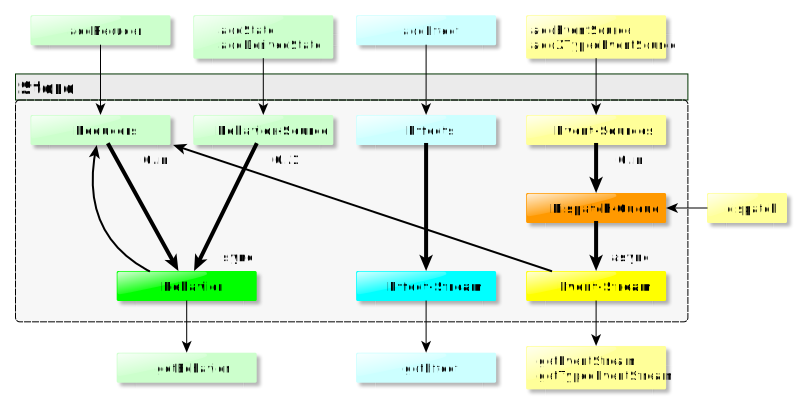

# Using rx-signals

1. [Using the store](#store)
    1. [Type Identifiers](#type-identifiers)
    1. [Events](#events)
    1. [Behaviors](#behaviors)
1. [Encapsulation via Signals-type](signals-type)
1. [Reusability and Composition via SignalsFactory-type](signals-factory-type)
    1. [The EffectSignalsFactory](#effect-signals-factory)
1. [Testing](#testing)

## Using the store <a name="store"></a>

The _rx-signals_ store is a class to reactively manage global state and effects.
It can also be used for local state and effects management via child stores.

* With respect to [state management](https://github.com/gneu77/rx-signals/blob/master/docs/rp_state_effects_start.md), the store is used
  * to define your explicit dependencies
  * to access state (including derived state)
* With respect to [reactivity](https://github.com/gneu77/rx-signals/blob/master/docs/rp_state_effects_start.md), the store is used
  * for change propagation
  * for reactive dependency injection
* With respect to [effects management](https://github.com/gneu77/blob/master/rx-signals/docs/rp_state_effects_start.md), the store
  * is the _world_ in pure function transformation
  * is the _runtime_ in effects isolation

The following diagram gives an overview for the _Store_ architecture and API.
For the full API, please see the [corresponding documentation](https://rawcdn.githack.com/gneu77/rx-signals/master/docs/tsdoc/index.html)

<a name="architecture"></a> 

### Type Identifiers <a name="type-identifiers"></a>

Type identifiers
* are used to uniquely identify a behavior or event-stream of the store
* provide type-safe access to behaviors and event-streams

For a given event- or behavior-type `T`, you can (and should) obtain a new `TypeIdentifier<T>` using `getIdentifier<T>(name?: string)` (this is not a store method, but an independent utility function).
The name-parameter is optional and usually not of any interest (except maybe for rare debugging-cases).
Under the hood, the returned identifier is a `symbol`. Thus, e.g. two calls of `getIdentifier<number>('MyNumber')` will return two different identifiers!

### Events <a name="events"></a>

If you don't know what an event-stream in the sense of RP is, then head back to [Terminology](https://github.com/gneu77/rx-signals/blob/master/README.md#terminology).

So in _rx-signals_, an event-stream is an _RxJs_-observable that has no current value, but dispatches values to subscribers at dicrete points of time. In addition to this definition, _rx-signals_-event-streams
1. always behave as hot observables piped with `share()`.
1. can have multiple sources that are subscribed by the store lazily (so only of the corresponding event-stream is subscribed)

> _Events_ are similar to actions in _Redux_-like libs.
> However, in contrast to _actions_, they are no objects with type and value, but instead they are the dispatched values itself.
> The type is an extra-argument to dispatch. Subscribers, specifically subscribe to one type of event.

#### Event-streams and basic event-sources

For a given `identifier`, you can get the corresponding event-stream from the store as follows:
```typescript
store.getEventStream(identifier: TypeIdentifier<T>);
```
The return value of this method is an `Observable<T>`, and if you're using TypeScript, it will infer the correct generic type for the returned observable, because it is encoded in the `identifier`.

From now on:
* the term _event-values-type_, always means the generic type of values
* the term _event-type_, means a certain `TypeIdentifier<T>`
Thus, for `const luckyNumbers = getIdentifier<number>();`, the _event-type_ would be `luckyNumbers`, while the _event-values-type_ would be `number`,

There can be multiple sources for a given _event-type_. One source that all event-streams have is a call to the dispatch function:
```typescript
store.dispatchEvent(identifier: TypeIdentifier<T>, value: T);
```

Calling `dispatchEvent` for an _event-type_ that has no subscribed event-stream is a NOOP.

You can add further event-sources as follows:
```typescript
store.addEventSource(
  sourceIdentifier: symbol,
  eventIdentifier: TypeIdentifier<T>,
  observable: Observable<T>
);
```
* a `sourceIdentifier` is required, because it must be possible to remove event-sources from the store.
* `eventIdentifier` is your _event-type_
* `observable` can be any observable of the correct _event-values-type_ (even a behavior)
  * The store will **not** eagerly subscribe the source-observable, but only, if the corresponding event-stream is subscribed

Of course, even if all added event-sources for a given _event-type_ complete, the corresponding event-stream will **not** complete (other sources may be added in the future / `dispatchEvent` is always possible).

#### Dispatch process

There are some important **guarantees** concerning event-dispatch (whether manually or via event-sources):
* The store always dispatches events asynchronously
  * Relying on synchronous dispatch would be bad, cause it would break reactive design (remember that one purpose of RP is to [abstract away the need to think about time](https://github.com/gneu77/rx-signals/blob/master/docs/rp_state_effects_start.md#abstract_away_time))
* Though async, the order in which events are dispatched will always be preserved
  * So dispatching e.g. two events `A`, `B`, the `B` will be dispatched only after **all** subscribers got the `A`
  * This holds true even for the dispatch-order between parent- and child-stores (cause they're using a shared dispatch-queue)
  * (This is one aspect that is not trivial to get right when wireing-up complex dependencies using plain _RxJs_ on your own)

Let's see this in action:
```typescript
const myEvent = getIdentifier<number>();
store.getEventStream(myEvent)
  .pipe(take(7))
  .subscribe(console.log);

store.addEventSource(
  Symbol('source1'), 
  myEvent,
  store.getEventStream(myEvent).pipe(
    filter(v => v === 3),
    mapTo(7)
  )
);
store.addEventSource(
  Symbol('source2'),
  myEvent,
  of(3, 4, 5)
);
console.log(1);
store.dispatchEvent(myEvent, 6);
console.log(2);
```

The output will be in order of the numbers:
1. `source2` adds `3`, `4` and `5` to the dispatch queue
1. `1` is logged
1. `6` is added to the dispatch queue
1. `2` is logged
1. Store dispatches `3` 
    1. `3` is logged
    1. `source1` adds `7` to the dispatch queue
1. Store dispatches `4`
...(etc)

Please have in mind that dispatching an event is always a side-effect. That means
* you should use `dispatchEvent` only to translate non-store events (like browser events) to store events
* event-sources are either effects or event-transformers (mapping from one _event-type_ to another)

The previous example was already a bit complicated and you should strive for a low number of event-sources that would lead to automatic dispatch->state->dispatch cycles.
Nevertheless, it's important to fully understand how the dispatch-queue works.
Say _N_ events are added to the dispatch-queue before the dispatch-queue-handler is invoked (asynchronously by the JS-event-loop), the handler will dispatch those _N_ events synchronously (in the order they were added).
Dispatching the _N_ events might lead to _M_ new events being added to the dispatch-queue.
Those _M_ new events however, will not be dispatched immediately, but again asynchronously in one of the next cycles of the JS-event-loop.
The following example illustrates this:
```typescript
const myEvent = getIdentifier<number>();
store.getEventStream(myEvent)
  .pipe(take(14))
  .subscribe(console.log); // 1, 2 -> 6, 21, 7, 22 -> 11, 26, 26, 41, 12, 27, 27, 42

store.addEventSource(
  Symbol('source1'),
  myEvent,
  store.getEventStream(myEvent).pipe(
    map(e => e + 5), // 6, 7 -> 11, 26, 12, 27
  ),
);
store.addEventSource(
  Symbol('source2'),
  myEvent,
  store.getEventStream(myEvent).pipe(
    map(e => e + 20), // 21, 22 -> 26, 41, 27, 42
  ),
);
store.dispatchEvent(myEvent, 1);
store.dispatchEvent(myEvent, 2);
```


(So 1 and 2 are dispatched synchronously, then in one of the next JS-event-loop-cycles 6, 21, 7 and 22 are dispatched synchronously, etc.)

#### Typed event-sources

You can also add event sources that dispatch multiple _event-types_.
E.g. a source that can dispatch 2 different _event-types_ with corresponding _event-values-types_ `A` and `B`:
```typescript
store.add2TypedEventSource(
  sourceIdentifier: symbol,
  eventIdentifierA: TypeIdentifier<A>,
  eventIdentifierB: TypeIdentifier<B>,
  observable: Observable<TypedEvent<A> | TypedEvent<B>>,
  subscribeObservableOnlyIfEventIsSubscribed?: null | TypeIdentifier<any>
)
```

As you can see, in this case, the source-observable must provide values of
```typescript
type TypedEvent<T> = Readonly<{
  type: TypeIdentifier<T>;
  event: T;
}>;
```
so that the store knows which _event-type_ to dispatch.

You might wonder about this optional parameter with the horrible name `subscribeObservableOnlyIfEventIsSubscribed`. Well, I was just not able to come up with a better name.
It is however one of the most powerful features of the store!
Think about the following scenario:
* You have an effect, hence an event-source that
  * produces the _event-types_ `myEffectSuccess` and `appError`
  * should **only** be executed, if the `myEffectSuccess` event is actually subscribed.
* You have a generic error-handler that subscribes to an _event-type_ `appError` over the whole lifetime of your application.

```typescript
store.add2TypedEventSource(
  Symbol(),
  myEffectSuccess,
  appError,
  of(
    { type: myEffectSuccess, event: mockResult },
    { type: appError, event: mockError },
  ),
  myEffectSuccess // subscribeObservableOnlyIfEventIsSubscribed
)
```

Without the last parameter, the `store.getEventStream(appError)` that you have somewhere in your global error-handler would automatically subscribe your 2-typed-event-source. Thus, the requirement that the effect should only be executed, if `myEffectSuccess` is subscribed would not be fulfilled.
However, with the last parameter, we are telling the store to subscribe the source only if `myEffectSuccess` is subscribed.

### Behaviors <a name="behaviors"></a>

If you don't know what a behavior in the sense of RP is, then head back to [Terminology](https://github.com/gneu77/rx-signals/blob/master/README.md#terminology).

So in _rx-signals_, a behavior is an _RxJs_-observable that always has the current value when subscribed.
In addition to this definition, _rx-signals_-behaviors
1. can be non-lazy or lazy
    1. Non-lazy behaviors are subscribed by the store itself as soon as you add them to the store. Or in _RxJs_-terminology, non-lazy behaviors are always made hot as soon as they are added to the store.
    1. Lazy behaviors will **not** be subscribed by the store. However, as soon as there are one or more subscribers, the store turns them into a hot observable.
1. <a name="distinct_pipe"></a> always behave as if piped with `distinctUntilChanged()` and `shareReplay(1)`. However, internally they do **not** use `shareReplay(1)` and thus, there is **no** risk of the memory-leaks that are possible with `shareReplay`.

Behaviors are used to model application state. Make sure to understand the importance of [modeling dependencies in your state explicitly](https://github.com/gneu77/rx-signals/blob/master/docs/rp_state_effects_start.md).
As a rule of thumb, those parts of the state that have no dependencies should be non-lazy, while dependent state should be modeled using lazy behaviors. (It is however also possible to make the complete state lazy, as well as it's possible to have non-lazy dependent state.)

#### Basic behaviors

No big surprise that getting a behavior from the store just requires an identifier:
```typescript
store.getBehavior(identifier);
```

Adding a lazy behavior source is done as follows:
```typescript
store.addLazyBehavior(
  identifier: TypeIdentifier<T>,
  observable: Observable<T>,
  initialValueOrValueGetter: T | (() => T) | symbol = NO_VALUE,
);
```

Adding a non-lazy behavior source has the same arguments:
```typescript
store.addNonLazyBehavior(id, observable, initialValueOrValueGetter);
```

* The `observable`, is the source of the behavior
  * In contrast to event-streams, a behavior can have only one source. So if you call `add(Non)LazyBehavior` two times with the same identifier, you will get an error on the second one (though you can remove a behavior source via `removeBehaviorSources` and then add a new source with the same identifier).
  * As for event-streams, if the behavior-source completes, the behavior will **not** complete.
    * In addition, after a behavior-source has completed, new subscribers of the behavior will still get the last value, as long as the behavior-source is not explicitly removed from the store!
    * However, having completing behavior-sources is often bad design. Prefer child-stores for behaviors that do not share the complete application lifetime. 
* The `initialValueOrValueGetter` is optional. It can be an inital value or a function that yields the initial value (so if the behavior is never subscribed, then the function will never be called).

When you call `getBehavior` you're not just getting a piped observable of whatever you added as behavior-source.
For example, you can subscribe a behavior even before a corresponding source has been added.
This is what makes cyclic dependencies and reactive dependency injection possible.

Here's an all-lazy example:
```typescript
type QueryResult = Readonly<{
  result: string[];
  resultQuery: string | null;
}>;

const query = getIdentifier<string>();
const result = getIdentifier<QueryResult>();
const pending = getIdentifier<boolean>();
const setQuery = getIdentifier<string>();
const setResult = getIdentifier<QueryResult>();

store.addLazyBehavior(query, store.getEventStream(setQuery), '');
store.addLazyBehavior(result, store.getEventStream(setResult), {
  result: [],
  resultQuery: null,
});
store.addLazyBehavior(
  pending,
  combineLatest([store.getBehavior(query), store.getBehavior(result)]).pipe(
    map(([q, r]) => q !== r.resultQuery),
  ),
);
store.addEventSource(
  Symbol('MockupQueryEffect'),
  setResult,
  combineLatest([store.getBehavior(query), store.getBehavior(result)]).pipe(
    filter(([q, r]) => q !== r.resultQuery),
    debounceTime(100),
    switchMap(([q]) => of({ result: [`mock result for ${q}`], resultQuery: q })),
  ),
);
```

Phew, a lot of code for a trivial (simplified) example!
But don't fear, there's no need to repeat such common patterns thanks to `SignalsFactories` and there'salso a better and more general way to cope with effects, both of which will be demonstrated in the [SignalsFactory-section](#signals-factory-type).

Here's a visual representation of the above setup:


As all behaviors are lazy, dispatching a `setQuery` event will be a no-op, as long as none of the behaviors is subscribed.
Subscribing to the `query` behavior only, would still not trigger the effect.
But as soon as the `pending` and/or the `result` behavior is subscribed, the effect (event-source) will start operating.
In other words, it would be no problem to defined the `query` behavior as non-lazy behavior (though there's no good reason to do so in this example).
In general, you should aim for as many lazy behaviors as possible.

However, there are definitely behaviors that must be non-lazy.
The rule is simple: If it would be a logical error that a behavior misses one of the events it depends on, then it must be non-lazy.

So far, defining a behavior that depends on multiple different events would be a bit clumsy (you'd have to use `getTypedEventStream` instead of `getEventStream` to differentiate between the merged events).
For such cases, the state-reducer API from the next section is much more straight forward.

#### State-Reducer API

There are additional convenience methods to add and reduce certain state.
```typescript
store.addState(identifier, initialValueOrValueGetter);
```
adds a non-lazy behavior-source (which so far would be equivalent to `store.addNonLazyBehavior(identifier, NEVER, initialValueOrValueGetter)` or `store.addNonLazyBehavior(identifier, of(initialValue))`).

However, you can add as many reducers for this state as you like, one for each event that should be handled (so trying to add a second reducer with the same stateIdentifier and eventIdentifier would result in an error):
```typescript
store.addReducer(
  stateIdentifier: TypeIdentifier<T>,
  eventIdentifier: TypeIdentifier<E>,
  stateReducer: (state: T, event: E) => T
);
```

It's time for the counter-example that is found in the documentation of almost all state-management libs:
```typescript
const counterState = getIdentifier<number>();
const increaseEvent = getIdentifier<number>();
const decreaseEvent = getIdentifier<number>();

store.addReducer(counterState, increaseEvent, (state, event) => state + event);
store.addReducer(counterState, decreaseEvent, (state, event) => state - event);
store.addState(counterState, 0);
```

As you can see, it's no problem to add reducers **before** the state itself is added.
This is possible, because all the wireing is done based on identifiers and not on the corresponding observables.
Hence, decoupling is achieved by defining dependencies based on identifiers instead of concrete sources.
This is the same approach as in classic dependency injection, just better, because it's reactive...

#### Reactive dependency injection <a name="reactive-di"></a>

DI as you know it from classic OO-programming, is used to decouple usage and creation of dependencies.
It thus allows for different concrete types without breaking dependencies, e.g. to allow for simple testability.
But there's a problem with classic DI. All dependencies still need to be available at the time of object creation (class instantiation), because they are used in imperative instead of reactive code.
Some DI-implementations even have problems with cyclic dependencies (which is no issue at all for our reactive DI).
Again, remember that one feature of RP is to [abstract away the need to think about time](https://github.com/gneu77/rx-signals/blob/master/docs/rp_state_effects_start.md#abstract_away_time).

Well, using _rx-signals_ your dependencies are just behaviors, it's as simple as that.
If you separate the setup of all other behaviors and event-streams, from the setup of behaviors for non-rx-signals-dependencies (like e.g. Angular HTTP-services), you can run a single integration test over all those other signals without the need to mock anything at all!
This will be detailed in the [Testing section](#testing)

> You might say 'Wait, isn't this more like a reactive service locator?'.
> Well yes, the store is some kind of service locator.
> And also no, because you don't get the dependencies itself from the store, but you get them wrapped into an observable.
> This makes all the difference, because all the arguments against classic service locators do not apply to the _rx-signals-store_!
> Thus, I don't like to bring in this somehow biased term and instead keep calling it reactive DI.

## Encapsulation via Signals-type <a name="signals-type"></a>

In the previous section, we tallied that in _rx-signals_, decoupling is done by wireing dependencies based on identifiers.
But of course, we still want to be able to somehow encapsulate certain behaviors and events together.
This leads to the following requirements:
* The creation of `TypeIdentifiers` and the setup of the store (using the `TypeIdentifiers`) must be separated somehow.
  * Because all `TypeIdentifiers` used in wireing must be available, when the setup starts.
* It must be possible to bundle the setup of certain behaviors and event-sources with the creation of corresponding `TypeIdentifiers`

Therefore, _rx-signals_ defines the `Signals` type as follows:
```typescript
type Signals<T extends SignalIds> = SetupWithStore & SignalTypes<T>;

// with:
type SignalIds = Readonly<{ [key: string]: TypeIdentifier<any> | SignalIds }>;
type SetupWithStore = { readonly setup: (store: Store) => void; };
type SignalTypes<T extends SignalIds> = { readonly ids: T; };
```

Let's see an example, where we encapsulate the creation of signals for counters:
```typescript
type CounterSignalIds = Readonly<{
  counterState: TypeIdentifier<number>;
  increaseEvent: TypeIdentifier<number>;
  decreaseEvent: TypeIdentifier<number>;
}>;
export const getCounterSignals: () => Signals<CounterSignalIds> = () => {
  const counterState = getIdentifier<number>();
  const increaseEvent = getIdentifier<number>();
  const decreaseEvent = getIdentifier<number>();
  return {
    ids: {
      counterState,
      increaseEvent,
      decreaseEvent,
    },
    setup: store => {
      store.addReducer(counterState, increaseEvent, (state, event) => state + event);
      store.addReducer(counterState, decreaseEvent, (state, event) => state - event);
      store.addState(counterState, 0);
    },
  };
};
```

Next, we encapsulate the creation of a signal that depends on two number-streams (calculating the sum of those numbers):
```typescript
type SumSignalIds = Readonly<{
  counterSum: TypeIdentifier<number>;
}>;
export const getSumSignals: (aId: TypeIdentifier<number>, bId: TypeIdentifier<number>) => 
  Signals<SumSignalIds> = (aId, bId) => {
    const counterSum = getIdentifier<number>();
    return {
      ids: { counterSum },
      setup: store => {
        store.addLazyBehavior(counterSum, combineLatest([
          store.getBehavior(aId),
          store.getBehavior(bId),
        ]).pipe(
          map(([a, b]) => a + b),
        ));
      },
    };
  };
```

And finally, we can create concrete signals:
```typescript
export const counter1Signals = getCounterSignals();
export const counter2Signals = getCounterSignals();
export const counterSumSignals = getSumSignals(
  counter1Signals.ids.counterState, 
  counter2Signals.ids.counterState
);
```

So we can use the `counterState`-IDs to create the signals for the dependent behavior, although no store setup has happened yet.
It is also irrelevant in which order the store setup is performed (you can call `counterSumSignals.setup(store)` before or after `counterNSignals.setup(store)`).

The two factories are free of any dependencies between each other (so not even on identifier-level).

A next improvement could be to combine the two factories into a new factory (to make the combination of two counters and their sum reusable):
```typescript
type CounterWithSumSignalIds = Readonly<{
  c1Ids: CounterSignalIds;
  c2Ids: CounterSignalIds;
  counterSum: TypeIdentifier<number>;
}>
export const getCounterWithSumSignals: () => Signals<CounterWithSumSignalIds> = () => {
  const counter1Signals = getCounterSignals();
  const counter2Signals = getCounterSignals();
  const counterSumSignals = getSumSignals(
    counter1Signals.ids.counterState,
    counter2Signals.ids.counterState,
  );
  return {
    ids: {
      c1Ids: counter1Signals.ids,
      c2Ids: counter2Signals.ids,
      counterSum: counterSumSignals.ids.counterSum,
    },
    setup: store => {
      counter1Signals.setup(store);
      counter2Signals.setup(store);
      counterSumSignals.setup(store);
    },
  }
};
```

The above way to compose a signals factory from two other factories might be OK in this trivial example.
But as soon as things get more complex, this kind of 'manual' composition becomes inflexible, verbose and error-prone.
The next section presents a signals factory type that allows for generalized composition.

## Reusability and Composition via SignalsFactory-type <a name="signals-factory-type"></a>

The previous section introduced the `Signals` type as means of encapsulation/isolation for the creation of IDs and setup of corresponding signals in the `Store`.
The given example even used factory functions to produce `Signals` and a new factory function was composed from the two initial factory functions.

To generalize factory composition, _rx-signals_ defines the following type:
```typescript
type SignalsFactory<T extends SignalIds> = Readonly<{
  build: () => Signals<T>;
  bind: <T2 extends SignalIds>(mapper: SignalsMapToFactory<T1, T2>) => SignalsFactory<MappedSignalTypes<T1, T2>>;
  fmap: <T2 extends SignalIds>(mapper: SignalsMapper<T1, T2>) => SignalsFactory<T2>;
  idsMap: <T2 extends SignalIds>(mapper: IdsMapper<T1, T2>) => SignalsFactory<T2>;
  flattenIds: () => SignalsFactory<FlattenComposedIds<T>>;
}>;

// with:
type MappedSignalTypes<T1 extends SignalIds, T2 extends SignalIds> = Readonly<{
  ids1: T1;
  ids2: T2;
}>;
type SignalsMapToFactory<T1 extends SignalIds, T2 extends SignalIds> = (signals: Signals<T1>) => SignalsFactory<T2>;
type SignalsMapper<T1 extends SignalIds, T2 extends SignalIds> = (signals: Signals<T1>) => Signals<T2>;
type IdsMapper<T1 extends SignalIds, T2 extends SignalIds> = (ids: T1) => T2;
```

This type actually defines a factory that builds the kind of `() => Signals<T>`-factories that were used in the previous section.
Hence, it's an additional abstraction layer over the `() => Signals<T>` type (actually _SignalsFactoryBuilder_ would have been a better name for this type, but it's `SignalsFactory` now.).

Of course, you do not have to implement the `bind`, `fmap`, `idsMap` and `flattenIds` methods yourself, but you only have to provide the `build` as an argument to `createSignalsFactory` (so an appropriate name for the type of the `createSignalsFactory`-function would be `SignalsFactoryBuilderFactory` :sweat_smile: ).

Before coming to a more real-world example, let's generalize the counter-sum-example from the previous section by turning the 'custom' signals factories into `SignalsFactory` types.
Based on our definitions for `getCounterSignals` and `getSumSignals`, we can turn these into `SignalsFactories` as follows:
```typescript
const counterFactory = createSignalsFactory(getCounterSignals);
const getSumSignalsFactory = (aId: TypeIdentifier<number>, bId: TypeIdentifier<number>) =>
  createSignalsFactory(() => getSumSignals(aId, bId));
```

Due to `getSumSignals` taking parameters, we actually have to create another factory that produces the desired `SignalsFactory`.
At first, this might seem to get a bit out of control (`getSumSignalsFactory` abstracts over a `SignalsFactory` that abstracts over `Signals`), but if you stick to wrapping everything into a `SignalsFactory`, the benefit is simple and flexible composition of these factories:
```typescript
const getCounterWithSumSignalsFactory: SignalsFactory<CounterWithSumSignalIds> =
  counterFactory
    .bind(() => counterFactory)
    .bind(s => getSumSignalsFactory(s.ids.ids1.counterState, s.ids.ids2.counterState))
    .idsMap(ids => ({
      c1Ids: { ...ids.ids1.ids1 },
      c2Ids: { ...ids.ids1.ids2 },
      counterSum: ids.ids2.counterSum,
    }));

const getCounterWithSumSignals = getCounterWithSumSignalsFactory.build();
```

So the `bind` composes two factories by taking a function parameter that maps from the first factories `Signals` to the second factory, resulting in a third factory (the composed factory).
`idsMap` can be used to change the resulting `SignalIds` type.
The `fmap` (not used in the example) maps from the first factories `Signals` to new `Signals`.
So in contrast to `idsMap`, the `fmap` can perform additional setup tasks with the store (will be seen in subsequent examples).
Finally, there's `flattenIds` which flattens `MappedSignalTypes<T1, T2>` to `FlattenComposedIds<MappedSignalTypes<T1, T2>>` (also used in the next example).

Now let's build something that is at least a bit closer to real-world requirements.

### Real-world example for factory composition

In the behaviors-section, we had an example of query-signals. 
This example presented neither reusable, nor generalized code.
So we start with some more general requirements for a _search with filtered, sorted and paged results_-SignalsFactory (we still keep the requirements simple, because later on, we will see that with `EffectsSignalsFactory`, _rx-signals_ already features a factory implementation that can be used in composition to cover many more requirements without the need to implement things yourself):
* The query-model for the filters should be generic
* The result-model should be generic
* The search should be invoked whenever the query-model, or the sorting, or the paging paramter changes

We will compose a corresponding `SignalsFactory` from smaller, generic and reusable factories.


So in the above diagram, the arrows show the direction of composition, hence dependencies are in the opposite direction.
There are 4 low-level components and 2 composed ones.

Here is a possible implementation for the _ModelFactory_ that is generic and could be used for any form-controlled model (and will be used to model the filter of our query):
```typescript
type ModelIds<T> = Readonly<{
  model: TypeIdentifier<T>;
  setModelEvent: TypeIdentifier<T>;
  updateModelEvent: TypeIdentifier<Partial<T>>;
  resetModelEvent: TypeIdentifier<void>;
}>;
const getModelSignals = <T>(defaultModel: T): Signals<ModelIds<T>> => {
  const model = getIdentifier<T>();
  const setModelEvent = getIdentifier<T>();
  const updateModelEvent = getIdentifier<Partial<T>>();
  const resetModelEvent = getIdentifier<void>();
  return {
    ids: {
      model,
      setModelEvent,
      updateModelEvent,
      resetModelEvent,
    },
    setup: store => {
      store.addState(model, defaultModel);
      store.addReducer(model, setModelEvent, (_, event) => event);
      store.addReducer(model, updateModelEvent, (state, event) => ({
        ...state,
        ...event,
      }));
      store.addReducer(model, resetModelEvent, () => defaultModel);
    },
  };
};
const getModelSignalsFactory = <T>(defaultModel: T) =>
  createSignalsFactory(() => getModelSignals(defaultModel));
```

It takes a `defaultModel` as parameter and as well, it exposes a `setModelEvent`. The latter e.g. could be used, if the factory serves for editing an existing model.

Next comes a possible implementation for our _SortParameterFactory_:
```typescript
type SortParameter = Readonly<{ propertyName?: string; descending: boolean }>;
type SortingIds = Readonly<{
  sorting: TypeIdentifier<SortParameter>;
  ascendingEvent: TypeIdentifier<string>;
  descendingEvent: TypeIdentifier<string>;
  noneEvent: TypeIdentifier<void>;
}>;
const getSortingSignals = (): Signals<SortingIds> => {
  const sorting = getIdentifier<SortParameter>();
  const ascendingEvent = getIdentifier<string>();
  const descendingEvent = getIdentifier<string>();
  const noneEvent = getIdentifier<void>();
  return {
    ids: {
      sorting,
      ascendingEvent,
      descendingEvent,
      noneEvent,
    },
    setup: store => {
      store.addState(sorting, { descending: false });
      store.addReducer(sorting, ascendingEvent, (_, propertyName) => ({
        propertyName,
        descending: false,
      }));
      store.addReducer(sorting, descendingEvent, (_, propertyName) => ({
        propertyName,
        descending: true,
      }));
      store.addReducer(sorting, noneEvent, () => ({ descending: false }));
    },
  };
};
const sortingSignalsFactory = createSignalsFactory(getSortingSignals);
```

Next the _PagingParameterFactory_:
```typescript
type PagingParameter = Readonly<{ page: number; pageSize: number }>;
type PagingIds = Readonly<{
  paging: TypeIdentifier<PagingParameter>;
  setPageEvent: TypeIdentifier<number>;
  setPageSizeEvent: TypeIdentifier<number>;
}>;
const getPagingSignals = (): Signals<PagingIds> => {
  const paging = getIdentifier<PagingParameter>();
  const setPageEvent = getIdentifier<number>();
  const setPageSizeEvent = getIdentifier<number>();
  return {
    ids: {
      paging,
      setPageEvent,
      setPageSizeEvent,
    },
    setup: store => {
      store.addState(paging, { page: 0, pageSize: 10 });
      store.addReducer(paging, setPageEvent, (state, page) => ({
        ...state,
        page,
      }));
      store.addReducer(paging, setPageSizeEvent, (state, pageSize) => ({
        ...state,
        pageSize,
      }));
    },
  };
};
const pagingSignalsFactory = createSignalsFactory(getPagingSignals);
```

Now we can compose these 3 factories to a _QueryInputFactory_:
```typescript
type FilteredSortedPagedQueryIds<FilterType> = ModelIds<FilterType> & SortingIds & PagingIds;
const getFilteredSortedPagedQuerySignalsFactory = <FilterType>(
  defaultFilter: FilterType,
): SignalsFactory<FilteredSortedPagedQueryIds<FilterType>> =>
  getModelSignalsFactory(defaultFilter)
    .bind(() => sortingSignalsFactory)
    .flattenIds()
    .bind(() => pagingSignalsFactory)
    .flattenIds()
    .fmap(s => ({
      ...s,
      setup: store => {
        s.setup(store);
        store.addEventSource(
          Symbol('resetPagingEffect'),
          s.ids.setPageEvent,
          merge(
            store.getEventStream(s.ids.resetModelEvent),
            store.getEventStream(s.ids.setModelEvent),
            store.getEventStream(s.ids.updateModelEvent),
            store.getEventStream(s.ids.ascendingEvent),
            store.getEventStream(s.ids.descendingEvent),
            store.getEventStream(s.ids.noneEvent),
          ).pipe(mapTo(0)),
        );
      },
    }));
```

In addition to just combining all signals, there is additional logic in the `fmap` block, adding an effect to reset the page (of the PagingParameter) to `0` whenever the filter or the sorting changes.

For the _EffectFactory_, we're using the `EffectSignalsFactory` that comes with _rx-signals_ and that will be explained in more details in the next sub-section of this document.

So we can compose our _QueryWithResultFactory_ as:
```typescript
const getQueryWithResultFactory = <FilterType, ResultType>(
  defaultFilter: FilterType,
  queryEffect: EffectType<[FilterType, SortParameter, PagingParameter], ResultType>,
) =>
  getFilteredSortedPagedQuerySignalsFactory(defaultFilter)
    .bind(s =>
      getEffectSignalsFactory(
        store =>
          combineLatest([
            store.getBehavior(s.ids.model),
            store.getBehavior(s.ids.sorting),
            store.getBehavior(s.ids.paging),
          ]),
        queryEffect,
      ),
    )
    .flattenIds();
```

All those factories are generic and can be reused or composed as necessary.
A concrete usage could be like this:
```typescript
type MyFilter = { firstName: string; lastName: string };
const resultEffect: EffectType<[MyFilter, SortParameter, PagingParameter], string[]> = (input, store) =>
  store.getBehavior(serviceIds.myService).pipe(
    switchMap(s => s.getResults(input[0], input[1], input[2])),
  );
const f = getQueryWithResultFactory({ firstName: '', lastName: '' }, resultEffect).build();
```

### The EffectSignalsFactory <a name="effect-signals-factory"></a>

Documentation WIP

## Testing <a name="testing"></a>

Documentation WIP
